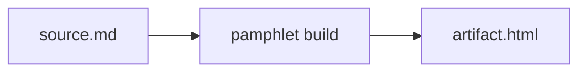

# Syntax

Pamphlet's syntax is a **strict CommonMark superset**: everything standard Markdown does still works, plus two additions — nine **container directives** and eight **diagram fences**. There is no third kind of extension.

Sources keep the `.md` extension and still read on GitHub: directives fall back to ordinary paragraphs, and ` ```mermaid ` fences are rendered natively by GitHub.

## Directives: one rule only

Every directive is written `:::name[label]{attrs}`, and there is exactly one rule:

- **`[label]` is always the title shown to the reader**
- **`{attrs}` are always parameters for the compiler**

Remember that and you need not memorise anything per directive.

```markdown
:::collapse[Advanced options]
This content is collapsed.
:::
```

:::warning Mind the colon count
**When nesting, the outer fence needs MORE colons than the inner one.** `:::tabs` wrapping `:::tab` does not work — same colon count means the first `:::` closes the outer fence. Write `::::tabs` wrapping `:::tab`.
:::

### The nine directives

| Directive | Label | Attributes | Notes |
|---|---|---|---|
| `tabs` | — | — | Container; must hold at least one `tab` |
| `tab` | **required** | `default` | Must sit directly inside `tabs`; at most one `{default}` per group |
| `collapse` | **required** | `open` | Collapsible block |
| `steps` | — | — | Must contain an ordered list |
| `reveal` | — | `effect` | `fade-up` (default) / `fade-in` / `slide-left` / `slide-right` |
| `info` `tip` `warn` `danger` | optional | — | The four callout types |

`class` and `id` are native to directive syntax and may be used on any directive.

### tabs / tab

```markdown
::::tabs

:::tab[Deployment view]{default}
Two availability zones, active-standby.
:::

:::tab[Cost view]
About ¥3,200 per month.
:::

::::
```

- A `tab` label is **required** — it is the button you click; no label means nothing to click
- At most one `{default}` per group; more than one is error `DIR-205`, not a silent pick-the-first
- With no `{default}` anywhere, the first tab is selected
- **With JavaScript off, all panels are expanded** and nothing is lost

### collapse

```markdown
:::collapse[Advanced options]{open}
Open by default. Drop `{open}` to start collapsed.
:::
```

The label is **required**. Without JavaScript this degrades to a native `<details>` whose `<summary>` is the label — with no label there is nothing clickable at all.

### steps

```markdown
:::steps
1. Install dependencies
2. Edit the config
3. Restart
:::
```

It **must contain an ordered list**, otherwise `DIR-204`. Numbering is computed by the browser; Pamphlet only styles it as circles.

### reveal

```markdown
:::reveal{effect=slide-left}
Slides in when scrolled into view.
:::
```

Four effects: `fade-up` (default), `fade-in`, `slide-left`, `slide-right`. Anything else is `DIR-206`, and the diagnostic lists the valid values.

### The four callouts

```markdown
:::info[By the way]
Neutral information.
:::

:::tip
A tip. The label is optional.
:::

:::warn[Careful]
This may go wrong.
:::

:::danger[Do not do this]
This will go wrong.
:::
```

The four names are `info` / `tip` / `warn` / `danger`. There is no umbrella `callout` directive.

:::tip Typos are handled
Diagnostics recognise other tools' spellings: `note` tells you "it is called info in Pamphlet", `warning` / `caution` point at `warn`, `important` points at `danger`, `details` / `accordion` point at `collapse`, and `tabset` points at `tabs`. Typos within edit distance 2 also get a suggestion.
:::

## Diagram fences: engine-native names only

The fence language name **is the engine's own name**; there are no house aliases. The Mermaid you learn in Pamphlet works unchanged in GitHub issues, Notion and the VS Code preview.

| Fence | Engine | Status in this version |
|---|---|---|
| `mermaid` | Mermaid | ✅ implemented |
| `d2` | d2 | planned |
| `dot` | Graphviz | planned |
| `math` | MathJax v3 | planned |
| `vega-lite` | Vega-Lite | planned |
| `wavedrom` | WaveDrom | planned |
| `bytefield` | bytefield-svg | planned |
| `plantuml` | PlantUML | planned |

Using a "planned" fence gets you `DIAG-301`, "no engine installed that can draw X", and the build fails.

````markdown

````

Diagrams are drawn to static SVG **at compile time** and inlined. The reader runs no diagram library and makes no network request.

### Diagrams follow the theme

Engine output colours are rewritten to theme variables, so in dark mode the strokes and labels change with everything else. Colours that could not be rewritten are reported as `DIAG-304` and listed — that does not fail the build, but it is telling you "these colours may be unreadable in dark mode".

### Maths is block-level only

````markdown
```math
E = mc^2
```
````

**Inline `$E=mc^2$` is not supported.** The reason is that `$` is everywhere in technical writing — `$ npm install`, `$HOME`, `$99` — so supporting it would require conflict detection and escaping rules, and a misfire turns ordinary prose into a formula.

Even a single symbol goes in a block fence; alternatively use raw HTML `<sub>` / `<sup>`, which passes through untouched.

## Raw HTML

HTML in the source **goes into the artifact untouched; the compiler filters nothing**. That is standard CommonMark behaviour and a deliberate choice here.

Two consequences you must know, covered in [raw HTML passes through untouched](/en/limits/raw-html): a single `<style>` block can override the whole theme system, and inline `<svg>` bypasses SVG sanitisation entirely.

## frontmatter

Configuration lives only in frontmatter; there is no config file:

```yaml
---
spec: 1
title: Architecture plan
theme: dark
lang: en
toc:
  enable: true
  deep: 3
---
```

All fields are listed in the [frontmatter reference](/en/reference/frontmatter).
