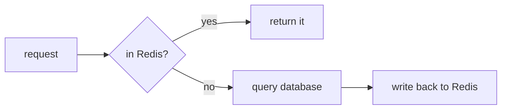

# Quick start

Type your way through this page and you will end up with an HTML file you can **double-click open, offline**.

You do not have to install anything.

## 1. Write a source file

Make a folder and put `plan.md` in it:

```markdown
---
title: Cache rework
toc: true
---

# Cache rework

Every request hits the database directly today. At peak, response time reaches 800ms.

:::warn[The short version]
Add a Redis layer. Expected to bring P99 under 120ms.
:::

::::tabs

:::tab[Before]{default}
request → app → database, every single time.
:::

:::tab[After]
request → app → return on a Redis hit, only query the database on a miss.
:::

::::

:::collapse[Cost breakdown]
One 4GB Redis node, about $45 a month.
:::
```

## 2. Compile

```bash
npx @nekoleapuki/pamphlet-cli build plan.md
```

`npx` ships with npm and means "download this package, run it once, don't leave it on my machine". The first run spends a dozen seconds downloading (measured: 86 packages, 15 seconds); after that npx has its own cache.

You will see:

```
plan.html  12.4KB
```

## 3. Open it

Double-click `plan.html`.

Now do three things to prove it really is self-contained:

:::steps
1. **Click the "After" tab.** The content switches — that is the small runtime the output carries, and it talks to nothing.
2. **Disconnect from the network and reload.** The page is identical. There is no `<link>`, no `<script src>`, no CDN reference anywhere in it.
3. **Send the file to someone.** Email, chat, USB stick — they double-click and see exactly the same thing.
:::

## 4. Add a diagram

Append this to `plan.md`:

````markdown

````

Compile again:

```bash
npx @nekoleapuki/pamphlet-cli build plan.md
```

**The first attempt fails**, with this diagnostic (compiler messages are Chinese-only for now):

```
error[DIAG-301] 没有装能画 mermaid 的引擎
  = 装一次就好：npm i -g mermaid-isomorphic playwright && npx playwright install chromium（首次约 150MB）
```

Drawing needs a real browser to measure text, so install it:

```bash
npm i -g mermaid-isomorphic playwright && npx playwright install chromium
```

About 150MB, about a minute, once. Why a browser is unavoidable: [Mermaid](/en/write/diagrams/mermaid).

Compile again and the diagram is in there — **as static SVG, with no diagram library running on the reader's side**.

## 5. See where the bytes went

```bash
npx @nekoleapuki/pamphlet-cli build plan.md --verbose
```

```
plan.html  33.7KB
  体积 33.7KB（gzip 10.6KB）
    图表 SVG          16.0KB  gzip     2.8KB  48%
    样式               5.7KB  gzip     1.4KB  17%
    正文 HTML          4.0KB  gzip     2.1KB  12%
    源文档注释            3.8KB  gzip     2.4KB  11%
    运行时              3.1KB  gzip     1.3KB  9%
    骨架                933B  gzip      574B  3%
```

The segments do not overlap and add up to the whole file. Pamphlet **sets no size limit**; it just itemises the bill — whether a diagram is worth 16KB is your call.

## Next

- If you use it often, [install it](/en/start/install) so the command becomes `pamphlet` instead of `npx @nekoleapuki/pamphlet-cli`
- [The nine directives](/en/write/directives/) — callouts, tabs, collapsibles, steps
- [What the output is](/en/design/output) — what it promises and what it does not
