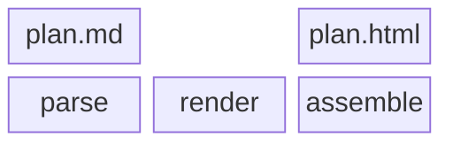

# Block diagrams

## What it is

Boxes laid out in rows and columns, gaps allowed. **It shows arrangement, not flow.**

## When to use it

Memory layout, protocol fields, how a page divides into regions.

## How to write it

Pamphlet's own syntax — **declarations first, relationships second**; all seventeen kinds share this skeleton:

````markdown
:::block[Three stages]{columns=3}
blocks:
  plan.md | - | plan.html
  parse | render | assemble
:::
````

That syntax does not render on GitHub. If you need it to, use this instead:

### The other way: a Mermaid fence

````markdown

````

## What comes out

Drawn to SVG at compile time and inlined into the output, so **the reader downloads no drawing library and makes no network request**. Colours follow the theme; scroll to zoom, drag to pan, double-click to reset.

## Traps

- `columns 3` sets the row width; `space` leaves an empty cell
- It draws no arrows and implies no order; for order use a [flowchart](/en/write/diagrams/flowchart)
- Still beta syntax, so it may change
