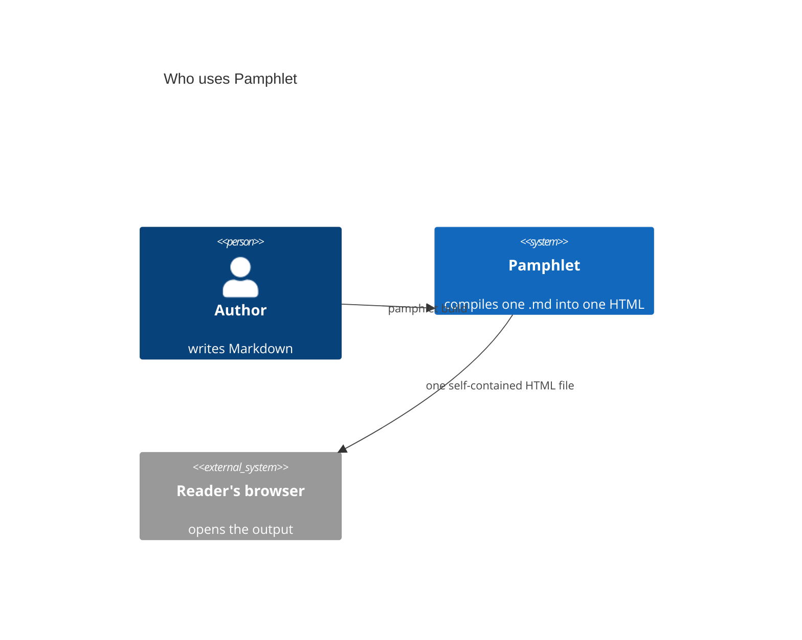

# System context (C4)

## What it is

The outermost view: **who uses this system and what it depends on**. The first level of the C4 model.

## When to use it

Explaining to a non-technical audience where this thing sits in the chain.

## How to write it

Pamphlet's own syntax — **declarations first, relationships second**; all seventeen kinds share this skeleton:

````markdown
:::c4[Who uses Pamphlet]
actors:
  author = person "Author"
  pf = system "Pamphlet"
  reader = external "Reader's browser"
relations:
  author -> pf : pamphlet build
  pf -> reader : one self-contained HTML
:::
````

That syntax does not render on GitHub. If you need it to, use this instead:

### The other way: a Mermaid fence

````markdown

````

## What comes out

Drawn to SVG at compile time and inlined into the output, so **the reader downloads no drawing library and makes no network request**. Colours follow the theme; scroll to zoom, drag to pan, double-click to reset.

## Traps

- `Person` is a human, `System` is yours, `System_Ext` is external (rendered in a different colour)
- The first argument is an ASCII id; the next two are the displayed name and description
- C4 also has `C4Container` and `C4Component` for finer levels
