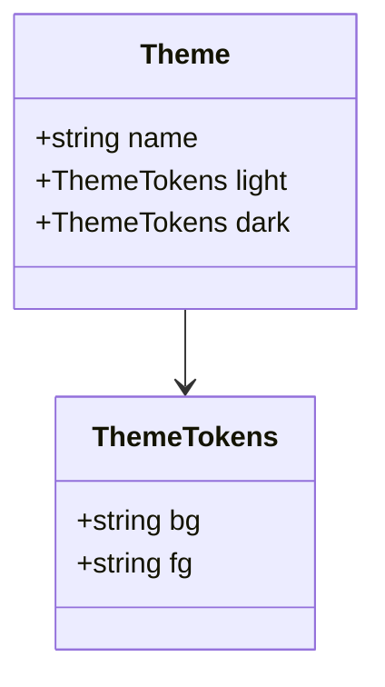

# Class diagrams

## What it is

Classes, their fields and methods, and how they relate.

## When to use it

Data structures, interface hierarchies, which module depends on which.

## How to write it

Pamphlet's own syntax — **declarations first, relationships second**; all seventeen kinds share this skeleton:

````markdown
:::class[Theme data]
classes:
  Theme
  ThemeTokens
relations:
  Theme -> ThemeTokens : light / dark
:::
````

That syntax does not render on GitHub. If you need it to, use this instead:

### The other way: a Mermaid fence

````markdown

````

## What comes out

Drawn to SVG at compile time and inlined into the output, so **the reader downloads no drawing library and makes no network request**. Colours follow the theme; scroll to zoom, drag to pan, double-click to reset.

## Traps

- `+` public, `-` private
- `-->` association, `<|--` inheritance, `*--` composition
- Past seven or eight classes nobody can follow it
