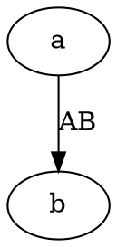

# Graphviz

## What it is

Graphviz dates back to 1991 and `dot` is its language. It solves one specific problem: **how to lay out a graph with many nodes**.

Dependency graphs, call chains and network topologies routinely have dozens or hundreds of nodes. Mermaid gets messy at that size; Graphviz's layered layout holds up.

## What it draws

| What it draws | How |
|---|---|
| Directed graphs (dependencies, call chains, flows) | `digraph`, edges written `->` |
| Undirected graphs (topologies, relationship webs) | `graph`, edges written `--` |
| State machines | `digraph` with the trigger in the edge label |

Unlike Mermaid there is no keyword per diagram kind — **there are only directed and undirected graphs**; everything else comes from attributes.

## How to write it

A graph is a pair of braces with the edges inside:

````markdown

````

For an undirected graph write `graph` instead of `digraph` and `--` instead of `->`. A node is created the first time its name appears; no separate declaration.

> Source: <https://graphviz.org/doc/info/lang.html>

## Install it once

It does not come with Pamphlet — install it when you need it, and everyone else downloads nothing (WASM 2.1MB，七个里最省的一个):

```bash
npm i -D @nekoleapuki/pamphlet-engine-graphviz
```

Then confirm with `pamphlet doctor`:

```
✓ graphviz（dot）
```

**Using the fence without installing it**: you get `DIAG-301` and **the whole build fails** (no placeholder box), with that command in the hint.

Licence: Apache-2.0.

Injecting theme colours does not touch a character of your source: the compiler has Graphviz canonicalise it first, then inserts default colours after the graph header. A colour you wrote on purpose stays, and is reported so you know it will not follow the theme.

## Traps

- **`digraph` requires `->` and `graph` requires `--`**; mixing them fails to parse
- Labels are `[label="text"]`, not a colon
- When edge labels distort the layout, use `[xlabel="text"]` instead — it is placed after every node is positioned and takes no part in the layout
- The WASM bundle is only 2.1MB, the smallest of the seven

> Sources: [ADR-0041](https://github.com/lazygophers/pamphlet/blob/master/docs/adr/0041-engines-are-separate-packages.md) (engines as separate packages), [ADR-0008](https://github.com/lazygophers/pamphlet/blob/master/docs/adr/0008-builtin-engines.md) (why these seven)
