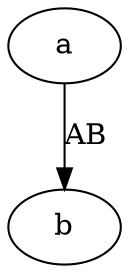

# Graphviz (not implemented yet)

## What it is

Graphviz dates back to 1991 and `dot` is its language. It solves one specific problem: **how to lay out a graph with many nodes**.

Dependency graphs, call chains and network topologies routinely have dozens or hundreds of nodes. Mermaid gets messy at that size; Graphviz's layered layout holds up.

## What it draws

| What it draws | How |
|---|---|
| Directed graphs (dependencies, call chains, flows) | `digraph`, edges written `->` |
| Undirected graphs (topologies, relationship webs) | `graph`, edges written `--` |
| State machines | `digraph` with the trigger in the edge label |

Unlike Mermaid there is no keyword per diagram kind — **there are only directed and undirected graphs**; everything else comes from attributes.

## How to write it

A graph is a pair of braces with the edges inside:

````markdown

````

For an undirected graph write `graph` instead of `digraph` and `--` instead of `->`. A node is created the first time its name appears; no separate declaration.

> Source: <https://graphviz.org/doc/info/lang.html>

## Where it stands

**The fence language `dot` is recognised, but the engine is not written yet.** Using it reports `DIAG-301` ("no engine installed that can draw dot") and **fails the build** — not a placeholder box, the whole compile stops.

The planned dependency shape is npm, WASM, no browser, optional like the other six: installing `@nekoleapuki/pamphlet-cli` gets you the compiler and no engines at all. [The other seven engines](/en/write/diagrams/others) explains why.

Until then, reach for the closest [Mermaid fence](/en/write/diagrams/mermaid/).

## Traps

- **`digraph` requires `->` and `graph` requires `--`**; mixing them fails to parse
- Labels are `[label="text"]`, not a colon
- When edge labels distort the layout, use `[xlabel="text"]` instead — it is placed after every node is positioned and takes no part in the layout
- The WASM bundle is only 2.1MB, the smallest of the seven

> Source: [ADR-0008](https://github.com/lazygophers/pamphlet/blob/master/docs/adr/0008-builtin-engines.md)
