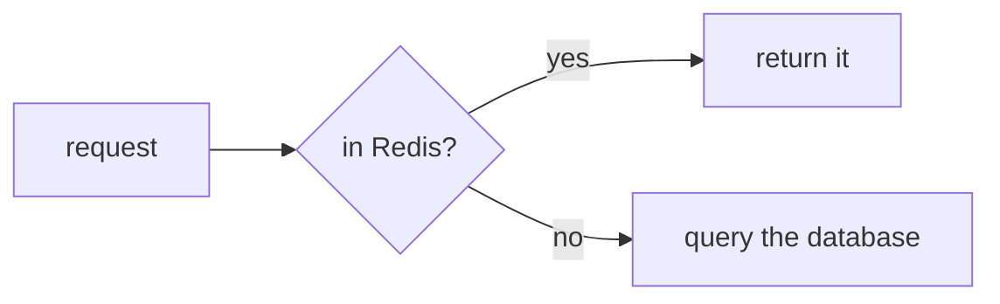

# Flowcharts

## What it is

One thing running start to finish, with branches along the way. **The most used kind.**

## When to use it

Business processes, decision branches, the few hops of a request path.

## How to write it

Pamphlet's own syntax — **declarations first, relationships second**; all seventeen kinds share this skeleton:

````markdown
:::flow[Login path]{dir=LR}
nodes:
  request = "request"
  cache = diamond "in cache?"
  hit = "return it"
  miss = cylinder "query the database"
edges:
  request -> cache
  cache -> hit : yes
  cache -> miss : no
:::
````

That syntax does not render on GitHub. If you need it to, use this instead:

### The other way: a Mermaid fence

````markdown

````

## What comes out

Drawn to SVG at compile time and inlined into the output, so **the reader downloads no drawing library and makes no network request**. Colours follow the theme; scroll to zoom, drag to pan, double-click to reset.

## Traps

- `LR` is left-to-right, `TD` top-down. Many nodes read better as `TD`; a few read flatter as `LR`
- `[box]` `(rounded)` `{diamond}` `[(cylinder)]` `([stadium])` each mean something — don't mix them arbitrarily
- **Fancy shapes like the trapezoid `[/text/]` blow up the SVG** (measured: 103KB for one diagram, 18KB after switching to rounded nodes)
