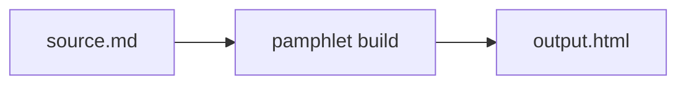

# Diagram fences

Diagrams are written as language-tagged code blocks and rendered to static SVG **at compile time**, inlined into the output. Readers run no diagram library and touch no network.

````markdown

````

## The language name is the engine's own name

Fence languages have **no Pamphlet-specific aliases**. The Mermaid syntax you learn here works the same in a GitHub issue, in Notion, in a VS Code preview.

| Fence language | Engine | This version |
|---|---|---|
| `mermaid` | Mermaid | ✅ [implemented](/en/write/diagrams/mermaid) |
| `d2` `dot` `math` `vega-lite` `wavedrom` `bytefield` `plantuml` | see [the other seven](/en/write/diagrams/others) | Planned |

Writing a planned one gets `DIAG-301`, "no engine installed that can draw X", and **the build fails**.

## Diagrams follow the theme

Engine output colours are substituted with theme variables, so the lines and text inside a diagram change with the dark colour scheme.

Hard-coded colours that could not be substituted report `DIAG-304` and are listed. That **does not** fail the build; it is telling you "these few colours may be hard to read in dark mode".

The six variables diagrams use are in [Theme tokens](/en/reference/theme-tokens).

## A failed diagram still produces output

Its place gets a **placeholder box** containing the reason and the original diagram source, everything else is normal, and the exit code is `1`.

That way you can see the problem is confined to that one diagram rather than the whole document failing.

## Large diagrams warn

A single diagram's SVG over **200KB** reports a `DIAG-302` warning. Usually it means too many nodes, which the reader cannot follow either — consider splitting it.

## Zoom and pan

Diagrams in the output support wheel zoom and drag panning. With JavaScript off the diagram still displays in full; it just does not zoom.
