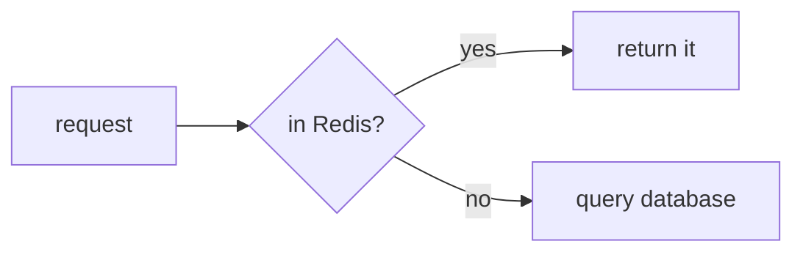

# Mermaid

**The only engine implemented in this version.** Flowcharts, sequence diagrams, Gantt charts and state diagrams all go through it.

````markdown

````

Mermaid's own syntax reference is at <https://mermaid.js.org/intro/>. Pamphlet neither changes its syntax nor adds extensions to it.

## Install it once

```bash
npm i -g mermaid-isomorphic playwright && npx playwright install chromium
```

About 150MB and a minute the first time. Confirm with `pamphlet doctor`:

```
✓ mermaid (mermaid)
```

## Why a browser has to be downloaded

Because **Mermaid needs a real browser's layout engine to measure text**.

jsdom (a pure-JavaScript fake browser) does not implement `SVGTextElement.getBBox()` — without knowing how wide a run of text is, there is no way to lay out the shapes around it.

This is not a preference. Mermaid organisation member @aloisklink ruled out the jsdom approach explicitly: <https://github.com/mermaid-js/mermaid/issues/3886#issuecomment-1341694822>

The cost lands on "install once", not "every run".

## The browser starts lazily

**A text-only document never launches it.** It starts only when a ` ```mermaid ` fence is actually encountered.

Measured:

| Case | Time |
|---|---|
| 1st diagram (including browser cold start) | 733ms |
| Each one after | 364ms |
| A 40-node diagram | 412ms |

The `DIAG-303` timeout is **10 seconds**, roughly 13× the worst measured case.

## When the diagram source is wrong

You get `DIAG-303`, and the hint suggests pasting the source into <https://mermaid.live> — Mermaid's official online editor, whose errors are clearer than the command line's.

## One extra step in CI

The image needs Chromium and its system dependencies:

```bash
npx playwright install --with-deps chromium
```

A full CI setup is in [Checking documents in CI](/en/howto/ci).

> Source: [ADR-0004](https://github.com/lazygophers/pamphlet/blob/master/docs/adr/0004-mermaid-via-headless-browser.md)
