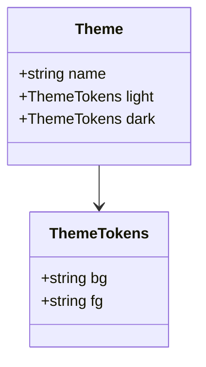

# Class diagrams (Mermaid fence)

## What it is

The same diagram as [Class diagrams](/en/write/diagrams/class); only **how you write it** differs. This page uses a ` ```mermaid ` fence and writes [Mermaid](/en/write/diagrams/mermaid/) source directly.

## When to use it

- **The source goes to GitHub and you want the diagram to render there** — Pamphlet's own syntax shows up as plain text on GitHub
- You already know Mermaid and would rather not learn a second thing
- You need something the own syntax cannot express (the Traps section below says what)

Otherwise use [the own syntax](/en/write/diagrams/class): the field names are fixed, and a mistake is reported on the line it is on.

## How to write it

````markdown

````

## What comes out

Drawn to SVG at compile time and inlined into the output, so **the reader downloads no drawing library and makes no network request**. Colours follow the theme; scroll to zoom, drag to pan, double-click to reset.

## Traps

- `+` public, `-` private
- `-->` association, `<|--` inheritance, `*--` composition
- Past seven or eight classes nobody can follow it
