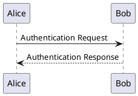

# PlantUML

## What it is

PlantUML is the only one of the seven that does **real UML**: component diagrams, use-case diagrams and activity diagrams that Mermaid either lacks or only approximates.

It is also the only one that **needs Java** — a known cost, see Traps.

## What it draws

| What it draws | Keyword |
|---|---|
| Sequence diagrams | just write `a -> b: message` |
| Class diagrams | `class` |
| Use-case diagrams | `usecase` / `actor` |
| Activity diagrams | `start` / `stop` / `if` |
| Component diagrams | `component` / `package` |
| State diagrams | `state` |
| Real C4 levels | `!include` the C4 standard library |

**Real C4 levels** are part of why it is here: Mermaid's `C4Context` only has the outermost one.

## How to write it

Every diagram is wrapped in `@startuml` / `@enduml`:

````markdown

````

`->` is solid and `-->` is dashed — the same convention as Mermaid's sequence diagram.

> Source: <https://plantuml.com/sequence-diagram>

## Install it once

It does not come with Pamphlet — install it when you need it, and everyone else downloads nothing (一个 jar，**还要 Java ≥ 11**):

```bash
npm i -D @nekoleapuki/pamphlet-engine-plantuml
```

Then confirm with `pamphlet doctor`:

```
✓ plantuml（plantuml）
```

**Using the fence without installing it**: you get `DIAG-301` and **the whole build fails** (no placeholder box), with that command in the hint.

Licence: LGPL (take the `plantuml-lgpl` jar).

It is not like the other six: not an npm package, so after installing the engine package you still **download the jar yourself**. Take `plantuml-lgpl` (no embedded GraphViz — Pamphlet wires Graphviz separately) and point `PLANTUML_JAR` at it.

Two more things: the diagrams it generates belong to whoever wrote the source and are not covered by the GPL; and **PlantUML occasionally shows sponsor messages on its welcome and error images** (never on a working diagram) — that is not something Pamphlet inserted.

## Traps

- **Java ≥ 11 is required.** It is a documented optional prerequisite, not a hidden one: `pamphlet doctor` runs `java -version` and gives a clear diagnostic when it is missing, instead of letting a raw `spawn` failure surface
- On Unix it must be invoked with `-Djava.awt.headless=true`, otherwise it reaches for X11 graphics libraries (<https://plantuml.com/faq-install>)
- It is a jar rather than an npm package, so installing it looks nothing like the other six

> Sources: [ADR-0041](https://github.com/lazygophers/pamphlet/blob/master/docs/adr/0041-engines-are-separate-packages.md) (engines as separate packages), [ADR-0008](https://github.com/lazygophers/pamphlet/blob/master/docs/adr/0008-builtin-engines.md) (why these seven)
