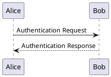

# PlantUML (not implemented yet)

## What it is

PlantUML is the only one of the seven that does **real UML**: component diagrams, use-case diagrams and activity diagrams that Mermaid either lacks or only approximates.

It is also the only one that **needs Java** — a known cost, see Traps.

## What it draws

| What it draws | Keyword |
|---|---|
| Sequence diagrams | just write `a -> b: message` |
| Class diagrams | `class` |
| Use-case diagrams | `usecase` / `actor` |
| Activity diagrams | `start` / `stop` / `if` |
| Component diagrams | `component` / `package` |
| State diagrams | `state` |
| Real C4 levels | `!include` the C4 standard library |

**Real C4 levels** are part of why it is here: Mermaid's `C4Context` only has the outermost one.

## How to write it

Every diagram is wrapped in `@startuml` / `@enduml`:

````markdown

````

`->` is solid and `-->` is dashed — the same convention as Mermaid's sequence diagram.

> Source: <https://plantuml.com/sequence-diagram>

## Where it stands

**The fence language `plantuml` is recognised, but the engine is not written yet.** Using it reports `DIAG-301` ("no engine installed that can draw plantuml") and **fails the build** — not a placeholder box, the whole compile stops.

The planned dependency shape is **a jar, needs Java ≥ 11**, optional like the other six: installing `@nekoleapuki/pamphlet-cli` gets you the compiler and no engines at all. [The other seven engines](/en/write/diagrams/others) explains why.

Until then, reach for the closest [Mermaid fence](/en/write/diagrams/mermaid/).

## Traps

- **Java ≥ 11 is required.** It is a documented optional prerequisite, not a hidden one: `pamphlet doctor` runs `java -version` and gives a clear diagnostic when it is missing, instead of letting a raw `spawn` failure surface
- On Unix it must be invoked with `-Djava.awt.headless=true`, otherwise it reaches for X11 graphics libraries (<https://plantuml.com/faq-install>)
- It is a jar rather than an npm package, so installing it looks nothing like the other six

> Source: [ADR-0008](https://github.com/lazygophers/pamphlet/blob/master/docs/adr/0008-builtin-engines.md)
