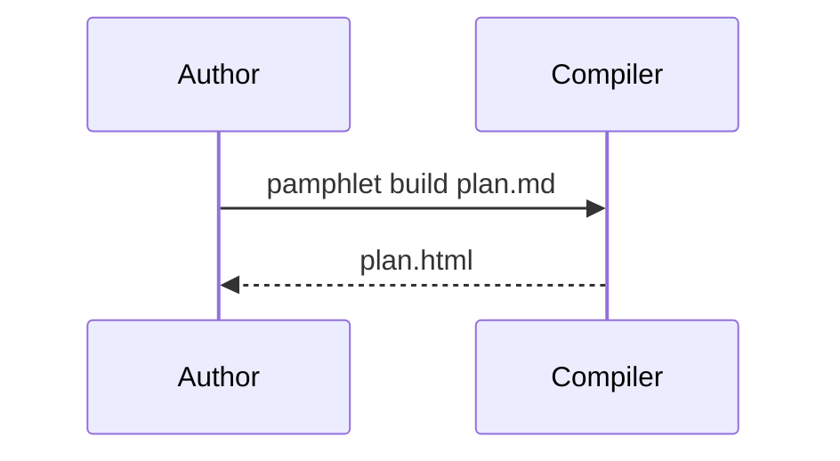

# Sequence diagrams

## What it is

Several participants passing messages back and forth **in time order**.

## When to use it

Call order across services, a handshake, anywhere "who goes first" is unclear.

## How to write it

Pamphlet's own syntax — **declarations first, relationships second**; all seventeen kinds share this skeleton:

````markdown
:::sequence[One compile]
participants:
  author = "Author"
  compiler = "Compiler"
messages:
  author -> compiler : pamphlet build plan.md
  compiler --> author : plan.html
:::
````

That syntax does not render on GitHub. If you need it to, use this instead:

### The other way: a Mermaid fence

````markdown

````

## What comes out

Drawn to SVG at compile time and inlined into the output, so **the reader downloads no drawing library and makes no network request**. Colours follow the theme; scroll to zoom, drag to pan, double-click to reset.

## Traps

- `->>` solid is a request, `-->>` dashed is a reply
- Past five participants it stops being readable; split it
- Participant names may be non-Latin
