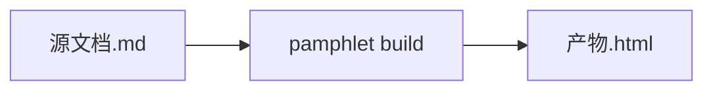

# 语法手册

Pamphlet 的语法是 **CommonMark 严格超集**：标准 Markdown 的一切照常工作，加上两样东西——九个**容器指令**和八种**图表围栏**。没有第三种扩展。

源文档沿用 `.md`，直接丢上 GitHub 仍然能读：指令会被当成普通段落，图表围栏里 ` ```mermaid ` 会被 GitHub 原生渲染。

## 指令：只有一条规则

全部指令都写成 `:::name[label]{attrs}`，规则只有一条：

- **`[label]` 永远是给读者看的标题**
- **`{attrs}` 永远是给编译器看的参数**

记住这一条就够了，不用逐个指令背。

```markdown
:::collapse[高级参数]
这里是折叠起来的内容。
:::
```

:::warning 注意冒号数量
**嵌套时外层的冒号必须比内层多。** `:::tabs` 包 `:::tab` 不成立——冒号一样多，第一个 `:::` 就把外层关掉了。写成 `::::tabs` 包 `:::tab`。
:::

### 九个指令一览

| 指令 | 标题 | 属性 | 说明 |
|---|---|---|---|
| `tabs` | — | — | 容器，至少含一个 `tab` |
| `tab` | **必填** | `default` | 只能直接放在 `tabs` 里；同组最多一个 `{default}` |
| `collapse` | **必填** | `open` | 折叠块 |
| `steps` | — | — | 里面必须有一个有序列表 |
| `reveal` | — | `effect` | `fade-up`（缺省）/ `fade-in` / `slide-left` / `slide-right` |
| `info` `tip` `warn` `danger` | 可选 | — | 四种提示块 |

`class` 与 `id` 是 directive 语法原生的，任何指令都能带。

### tabs / tab

```markdown
::::tabs

:::tab[部署视图]{default}
两个可用区，互为主备。
:::

:::tab[成本视图]
月成本约 ¥3,200。
:::

::::
```

- `tab` 的标题**必填**——它就是那个可以点的按钮，没标题就没有可点的东西
- 同组最多一个 `{default}`；多了报错 `DIR-205`，不静默取第一个
- 都不标 `{default}` 时选中第一个
- **关掉 JavaScript 时三个面板全部展开**，一个字不丢

### collapse

```markdown
:::collapse[高级参数]{open}
默认展开。去掉 `{open}` 就是默认收起。
:::
```

标题**必填**。无 JavaScript 时降级成原生 `<details>`，标题就是 `<summary>`——没标题就连可点的部分都没有。

### steps

```markdown
:::steps
1. 装依赖
2. 改配置
3. 重启
:::
```

里面**必须有一个有序列表**，否则报 `DIR-204`。编号由浏览器算，Pamphlet 只负责把它做成圆圈样式。

### reveal

```markdown
:::reveal{effect=slide-left}
滚动到这里时滑入。
:::
```

四种效果：`fade-up`（缺省）、`fade-in`、`slide-left`、`slide-right`。写别的报 `DIR-206` 并列出可用值。

### 四种提示块

```markdown
:::info[顺带一提]
中性信息。
:::

:::tip
小技巧。标题可以不写。
:::

:::warn[小心]
可能出问题。
:::

:::danger[别这么干]
一定会出问题。
:::
```

四个名字就是 `info` / `tip` / `warn` / `danger`，没有统称的 `callout` 指令。

:::tip 打错了也不要紧
诊断认得出别的工具的写法：`note` 会告诉你「在 Pamphlet 里叫 info」，`warning` / `caution` 指向 `warn`，`important` 指向 `danger`，`details` / `accordion` 指向 `collapse`，`tabset` 指向 `tabs`。编辑距离 ≤ 2 的拼写错误也会给出建议。
:::

## 图表围栏：只用引擎原生名

围栏的语言名**就是引擎自己的名字**，没有自有别名。你在 Pamphlet 里练会的 Mermaid 语法，在 GitHub issue、Notion、VS Code 预览里同样有效。

| 围栏语言 | 引擎 | 本版本状态 |
|---|---|---|
| `mermaid` | Mermaid | ✅ 已实现 |
| `d2` | d2 | 计划中 |
| `dot` | Graphviz | 计划中 |
| `math` | MathJax v3 | 计划中 |
| `vega-lite` | Vega-Lite | 计划中 |
| `wavedrom` | WaveDrom | 计划中 |
| `bytefield` | bytefield-svg | 计划中 |
| `plantuml` | PlantUML | 计划中 |

「计划中」的写了会得到 `DIAG-301`「没有装能画 X 的引擎」，构建失败。

````markdown

````

图在**编译时**画成静态 SVG 内联进产物。读者那边不跑任何图表库，也不联网。

### 图表跟着主题变色

引擎输出的颜色会被替换成主题变量，所以切到深色模式时图里的线和字一起变。换不掉的硬编码色值会报 `DIAG-304` 并列出来——这不会让构建失败，但它在告诉你「这几个颜色在暗色下可能看不清」。

### 数学公式只有块级

````markdown
```math
E = mc^2
```
````

**不支持行内 `$E=mc^2$`。** 原因是 `$` 在技术文档里到处都是——`$ npm install`、`$HOME`、`$99`——支持它就必须设计冲突判定和转义规则，而误判会把一段正常文字变成公式。

只有一个符号也要写成块级围栏；或者用裸 HTML 的 `<sub>` / `<sup>`（裸 HTML 原样通过）。

## 裸 HTML

源文档里的 HTML **原样进产物，编译器不做任何过滤**。这是 CommonMark 的标准行为，也是有意的设计。

两个必须知道的后果，见[裸 HTML 原样通过](/limits/raw-html)：一段 `<style>` 能盖掉整个主题系统；内联 `<svg>` 完全绕过 SVG 消毒。

## frontmatter

配置只在 frontmatter 里，没有配置文件：

```yaml
---
spec: 1
title: 架构方案
theme: dark
lang: zh
toc:
  enable: true
  deep: 3
---
```

全部字段见 [frontmatter 参考](/reference/frontmatter)。
