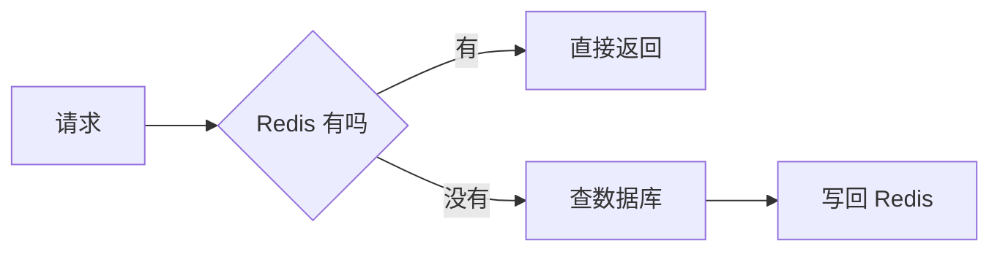

# 快速开始

跟着敲完这一页，你会得到一个**能双击打开、断网也能看**的 HTML 文件。

全程不需要安装任何东西。

## 1. 建一份源文档

新建一个文件夹，在里面建 `方案.md`：

```markdown
---
title: 缓存改造方案
toc: true
---

# 缓存改造方案

现在每次请求都直接打数据库，高峰期响应时间到 800ms。

:::warn[先说结论]
加一层 Redis，预计把 P99 压到 120ms 以内。
:::

::::tabs

:::tab[改造前]{default}
请求 → 应用 → 数据库，每次都查。
:::

:::tab[改造后]
请求 → 应用 → Redis 命中就返回，未命中才查数据库。
:::

::::

:::collapse[成本明细]
Redis 单节点 4GB，月成本约 ¥320。
:::
```

## 2. 编译

```bash
npx @pamphlet/cli build 方案.md
```

`npx` 是 npm 自带的命令，意思是「下载这个包、跑一次、不留在电脑里」。第一次要花十几秒下载（实测 86 个依赖、15 秒），之后有缓存。

跑完你会看到：

```
方案.html  12.4KB
```

## 3. 打开它

双击 `方案.html`。

现在做三件事验证它真的是自包含的：

:::steps
1. **点一下「改造后」那个标签页。** 内容会切换 —— 这是产物自带的那段小脚本干的，不联网。
2. **断开网络，再刷新一次。** 页面完全不变。产物里没有 `<link>`、没有 `<script src>`、没有任何 CDN 引用。
3. **把文件发给别人。** 微信、邮件、U 盘都行，对方双击就能看到一模一样的东西。
:::

## 4. 加一张图

在 `方案.md` 末尾加一段：

````markdown

````

再编译一次：

```bash
npx @pamphlet/cli build 方案.md
```

**第一次会失败**，得到这样一条诊断：

```
error[DIAG-301] 没有装能画 mermaid 的引擎
  = 装一次就好：npm i -g mermaid-isomorphic playwright && npx playwright install chromium（首次约 150MB）
```

画图要用真实浏览器算文字宽度，所以得先装：

```bash
npm i -g mermaid-isomorphic playwright && npx playwright install chromium
```

约 150MB、约 1 分钟，装一次就够。为什么非要浏览器不可，见[为什么 Mermaid 要下一个浏览器](/write/diagrams/mermaid)。

装完再编译，图就画进去了 —— **是静态 SVG，读者那边不跑任何图表库**。

## 5. 看看体积花在哪

```bash
npx @pamphlet/cli build 方案.md --verbose
```

```
方案.html  33.7KB
  体积 33.7KB（gzip 10.6KB）
    图表 SVG          16.0KB  gzip     2.8KB  48%
    样式               5.7KB  gzip     1.4KB  17%
    正文 HTML          4.0KB  gzip     2.1KB  12%
    源文档注释            3.8KB  gzip     2.4KB  11%
    运行时              3.1KB  gzip     1.3KB  9%
    骨架                933B  gzip      574B  3%
```

各段互不重叠，加起来正好是整份产物。Pamphlet **不设体积门槛**，只把账摊开 —— 要不要为了 16KB 去掉一张图，是你的判断。

## 接下来

- 常用的话[装到本地](/start/install)，命令名就变成 `pamphlet`，不用每次打 `npx @pamphlet/cli`
- [九个指令怎么写](/write/directives/) —— 提示块、标签页、折叠、步骤
- [产物是什么样的](/design/output) —— 它承诺什么、不承诺什么
