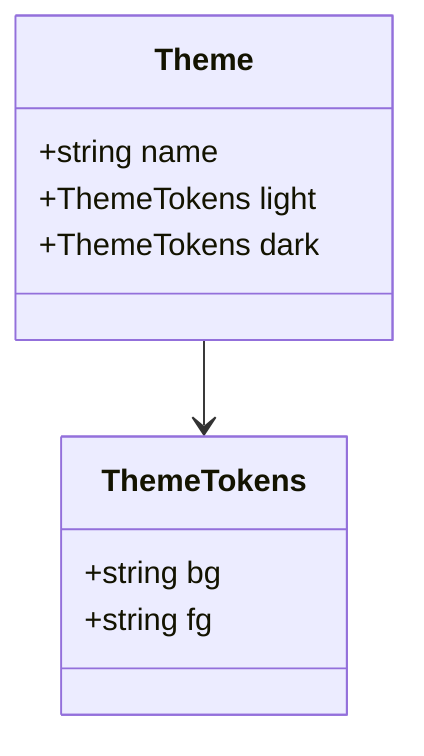

# 类图

## 这是什么

类、字段、方法，以及类之间的关系。

## 什么时候用

画数据结构、画接口继承、画模块之间谁依赖谁。

## 怎么写

Pamphlet 自己的写法——**先列声明、再列关系**，十七种图共用这副骨架：

````markdown
:::class[主题的数据结构]
classes:
  Theme
  ThemeTokens
relations:
  Theme -> ThemeTokens : light / dark
:::
````

上面那种写法在 GitHub 上不会渲染。要 GitHub 也能看，用下面这种：

### 另一种写法：Mermaid 围栏

````markdown

````

## 出来是什么样

编译时就画成 SVG 内联进产物，**读者那边不下载任何绘图库、也不联网**。颜色跟着主题走，可以滚轮缩放、按住拖动、双击复位。

## 坑

- `+` 是公开，`-` 是私有
- `-->` 是关联，`<|--` 是继承，`*--` 是组合
- 一张图里超过七八个类就读不动了
