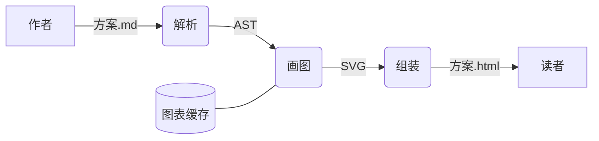

# 数据流图

## 这是什么

**数据**从哪来、经过哪几步加工、存到哪、最后给谁。

## 什么时候用

画一条数据链路、画一次请求的处理过程。

## 怎么写

Pamphlet 自己的写法——**先列声明、再列关系**，十七种图共用这副骨架：

````markdown
:::dataflow[编译一份文档]
nodes:
  author = "作者"
  parse = round "解析"
  render = round "画图"
  cache = cylinder "图表缓存"
  reader = "读者"
flows:
  author -> parse : 方案.md
  parse -> render : AST
  cache -> render
  render -> reader : 方案.html
:::
````

上面那种写法在 GitHub 上不会渲染。要 GitHub 也能看，用下面这种：

### 另一种写法：Mermaid 围栏

````markdown

````

## 出来是什么样

编译时就画成 SVG 内联进产物，**读者那边不下载任何绘图库、也不联网**。颜色跟着主题走，可以滚轮缩放、按住拖动、双击复位。

## 坑

- **数据流图没有专门的语法，用[流程图](/write/diagrams/flowchart)画**，靠形状区分角色
- 老规矩：**方框**是外部的人或系统、**圆角**是处理步骤、**圆柱**是存起来的东西
- 箭头上的字是**流过去的数据**（`方案.md`、`AST`），不是动作
