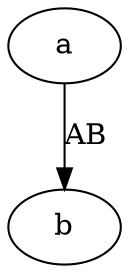

# Graphviz（还没实现）

## 这是什么

Graphviz 是 1991 年就有的老牌绘图工具，`dot` 是它的语言。它解决的是一个具体问题：**节点多的时候怎么排**。

依赖关系、调用链、网络拓扑这类图动辄几十上百个节点，Mermaid 排到后面会乱，Graphviz 的分层布局算法排得住。

## 它能画哪些图

| 画什么 | 写法 |
|---|---|
| 有向图（依赖、调用链、流程） | `digraph`，边用 `->` |
| 无向图（拓扑、关系网） | `graph`，边用 `--` |
| 状态机 | `digraph` 加上边标签写触发条件 |

它不像 Mermaid 那样「一种关键字一种图」——**只有有向图和无向图两种**，别的都是靠属性调出来的。

## 怎么写

一个图就是一对大括号，边写在里面：

````markdown

````

无向图把 `digraph` 换成 `graph`、`->` 换成 `--`。节点第一次出现时自动创建，不用单独声明。

> 出处：<https://graphviz.org/doc/info/lang.html>

## 现在什么状态

**围栏语言 `dot` 认得，但引擎还没写。** 写了会得到 `DIAG-301`「没有装能画 dot 的引擎」，并且**构建失败**——不是画不出来留个占位框，是整次编译不通过。

将来的依赖形态是npm，WASM，无浏览器，和其余六个一样列为可选依赖：装 `@nekoleapuki/pamphlet-cli` 只得到编译器本体，一个引擎都不带。为什么这么安排见[其余七种引擎](/write/diagrams/others)。

现在要画这种图，先用 [Mermaid 围栏](/write/diagrams/mermaid/)里最接近的一种顶着。

## 坑

- **`digraph` 必须配 `->`，`graph` 必须配 `--`**，混用直接解析失败
- 标签用 `[label="文字"]`，不是冒号
- 边标签把版面挤歪时，换成 `[xlabel="文字"]`——它在所有节点排好之后才放，不参与布局
- WASM 包只有 2.1MB，是七个里最小的

> 出处：[ADR-0008](https://github.com/lazygophers/pamphlet/blob/master/docs/adr/0008-builtin-engines.md)
