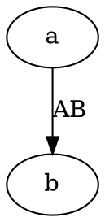

# Graphviz

## 这是什么

Graphviz 是 1991 年就有的老牌绘图工具，`dot` 是它的语言。它解决的是一个具体问题：**节点多的时候怎么排**。

依赖关系、调用链、网络拓扑这类图动辄几十上百个节点，Mermaid 排到后面会乱，Graphviz 的分层布局算法排得住。

## 它能画哪些图

| 画什么 | 写法 |
|---|---|
| 有向图（依赖、调用链、流程） | `digraph`，边用 `->` |
| 无向图（拓扑、关系网） | `graph`，边用 `--` |
| 状态机 | `digraph` 加上边标签写触发条件 |

它不像 Mermaid 那样「一种关键字一种图」——**只有有向图和无向图两种**，别的都是靠属性调出来的。

## 怎么写

一个图就是一对大括号，边写在里面：

````markdown

````

无向图把 `digraph` 换成 `graph`、`->` 换成 `--`。节点第一次出现时自动创建，不用单独声明。

> 出处：<https://graphviz.org/doc/info/lang.html>

## 先装一次

它不跟着 Pamphlet 一起装——用到才装，不用的人一个字节都不多（WASM 2.1MB，七个里最省的一个）：

```bash
npm i -D @nekoleapuki/pamphlet-engine-graphviz
```

装完跑 `pamphlet doctor` 确认：

```
✓ graphviz（dot）
```

**没装就用这种围栏会怎样**：得到 `DIAG-301` 并且**整次编译失败**（不是留个占位框），提示里就是上面那条命令。

许可证：Apache-2.0。

哨兵注入不改你写的任何一个字符：编译器先让 Graphviz 自己把图源规范化一遍，再往图头后面插默认配色。所以你在图源里特意写的颜色**留着不动**，并且会被报出来告诉你它不跟主题。

## 坑

- **`digraph` 必须配 `->`，`graph` 必须配 `--`**，混用直接解析失败
- 标签用 `[label="文字"]`，不是冒号
- 边标签把版面挤歪时，换成 `[xlabel="文字"]`——它在所有节点排好之后才放，不参与布局
- WASM 包只有 2.1MB，是七个里最小的

> 出处：[ADR-0041](https://github.com/lazygophers/pamphlet/blob/master/docs/adr/0041-engines-are-separate-packages.md)（引擎各自成包）、[ADR-0008](https://github.com/lazygophers/pamphlet/blob/master/docs/adr/0008-builtin-engines.md)（为什么是这七个）
