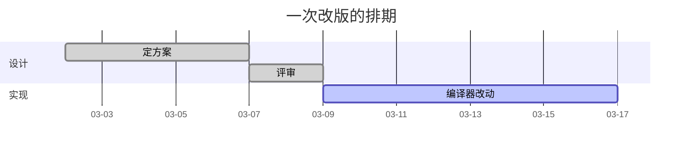

# 甘特图

## 这是什么

一条时间轴上，哪件事什么时候开始、做多久。

## 什么时候用

画排期、画一次发布的时间安排、画依赖顺序。

## 怎么写

Pamphlet 自己的写法——**先列声明、再列关系**，十七种图共用这副骨架：

````markdown
:::gantt[一次改版的排期]
sections:
  设计
  实现
tasks:
  设计 : 定方案 : 2026-03-02 : 5d
  设计 : 评审 : after 定方案 : 2d
  实现 : 编译器改动 : after 评审 : 8d
:::
````

上面那种写法在 GitHub 上不会渲染。要 GitHub 也能看，用下面这种：

### 另一种写法：Mermaid 围栏

````markdown

````

## 出来是什么样

编译时就画成 SVG 内联进产物，**读者那边不下载任何绘图库、也不联网**。颜色跟着主题走，可以滚轮缩放、按住拖动、双击复位。

## 坑

- `done` 已完成（灰）、`active` 进行中（主色）、`crit` 关键路径（强调色）
- `after a1` 表示接着上一项开始，不用自己算日期
- **`dateFormat X`（纯数字轴）容易排得很奇怪**，用真实日期更稳
