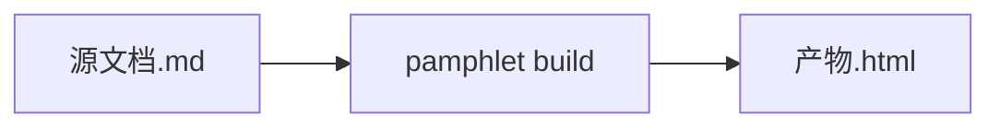

# 图表围栏

图写成带语言标记的代码块，**编译时**画成静态 SVG 内联进产物。读者那边不跑任何图表库，也不联网。

````markdown

````

## 语言名就是引擎自己的名字

围栏的语言名**没有自有别名**。你在 Pamphlet 里练会的 Mermaid 语法，在 GitHub issue、Notion、VS Code 预览里同样有效。

| 围栏语言 | 引擎 | 本版本 |
|---|---|---|
| `mermaid` | Mermaid | ✅ [已实现](/write/diagrams/mermaid) |
| `d2` `dot` `math` `vega-lite` `wavedrom` `bytefield` `plantuml` | 见[其余七种](/write/diagrams/others) | 计划中 |

「计划中」的写了会得到 `DIAG-301`「没有装能画 X 的引擎」，**构建失败**。

## 图跟着主题变色

引擎输出的颜色会被替换成主题变量，所以切到深色模式时图里的线和字一起变。

换不掉的硬编码色值会报 `DIAG-304` 并列出来 —— 这**不会**让构建失败，但它在告诉你「这几个颜色在暗色下可能看不清」。

图表用的那六个变量见[主题 token](/reference/theme-tokens)。

## 图画不出来时产物照样写出来

那张图的位置留一个**占位框**，里面写着出错原因和原始图源，其余部分完全正常，同时退出码是 `1`。

这样你能立刻看出问题只在那一张图上，而不是整份文档编不出来。

## 图太大会警告

单张图的 SVG 超过 **200KB** 报 `DIAG-302` 警告。图太大通常意味着节点太多，读者也看不清 —— 考虑拆成几张。

## 可以缩放拖动

产物里的图支持鼠标滚轮缩放、拖动平移。关掉 JavaScript 时图仍然完整显示，只是不能缩放。
