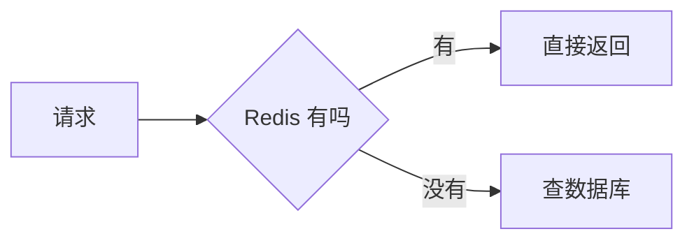

# Mermaid

本版本**唯一实现了的引擎**。一个围栏语言 `mermaid`，十几种图都归它画。

````markdown

````

Mermaid 自己的语法手册在 <https://mermaid.js.org/intro/>。Pamphlet 不改它的语法，也不加自己的扩展。

## 画得出哪些图

每一种都在[示例文档](https://lazygophers.github.io/pamphlet/demo/)里有一张真的，颜色全部跟着主题走。第一行的关键字决定画哪种：

| 写什么 | 画出来是 |
|---|---|
| `flowchart` / `graph` | 流程图。**数据流图也用它**：方框是外部的人、圆角是处理、`[(…)]` 是存起来的东西 |
| `sequenceDiagram` | 时序图 |
| `stateDiagram-v2` | 状态图 |
| `classDiagram` | 类图 |
| `erDiagram` | 实体关系图 |
| `gantt` | 甘特图 |
| `pie` | 饼图 |
| `architecture-beta` | **架构图**，自带 `cloud` `database` `disk` `server` 等图标 |
| `C4Context` / `C4Container` / `C4Component` | **系统上下文图**（C4 那一套） |
| `mindmap` | 思维导图 |
| `gitGraph` | 分支图 |
| `block-beta` | 块图 |
| `timeline` / `quadrantChart` / `journey` / `packet-beta` / `radar-beta` / `xychart-beta` | 画得出来，但**有几处颜色不跟主题走**，会报 `DIAG-304` |

:::warn 两种图不认中文
`sankey-beta`（桑基图）和 `requirementDiagram`（需求图）的解析器只认 ASCII 标识符，中文节点名会直接报 `DIAG-303`。实测于 mermaid 11.17.2。

要画数据流量分配，用 `flowchart` 把数值写在连线标签上。
:::

:::info 架构图的 ID 要用英文
`architecture-beta` 的 group / service **ID** 必须是 ASCII（`service src(disk)[源文档]`），方括号里的**标签**照样可以写中文。
:::

## 先装一次

```bash
npm i -g mermaid-isomorphic playwright && npx playwright install chromium
```

首次约 150MB、约 1 分钟。装完跑 `pamphlet doctor` 确认：

```
✓ mermaid（mermaid）
```

## 为什么要下一个浏览器

因为 **Mermaid 必须用真实浏览器的布局引擎算文字尺寸**。

jsdom（一个纯 JavaScript 的假浏览器）没有实现 `SVGTextElement.getBBox()` —— 量不出一段文字有多宽，就没法为图形排版。

这不是选型偏好。Mermaid 组织成员 @aloisklink 明确否定过 jsdom 方案：<https://github.com/mermaid-js/mermaid/issues/3886#issuecomment-1341694822>

代价落在「装一次」而不是「每次用」。

## 浏览器是惰性启动的

**纯文字文档永远不会拉起它。** 只有真的遇到 ` ```mermaid ` 围栏才启动。

实测数据：

| 场景 | 耗时 |
|---|---|
| 第 1 张图（含浏览器冷启动） | 733ms |
| 之后每张 | 364ms |
| 40 节点大图 | 412ms |

`DIAG-303` 的超时门槛是 **10 秒**，约是最坏值的 13 倍。

## 图源写错了怎么办

得到 `DIAG-303`，提示会建议把图源贴到 <https://mermaid.live> 上定位 —— 那是 Mermaid 官方的在线编辑器，报错比命令行清楚。

## CI 里要多做一步

镜像里得装 Chromium 及其系统依赖：

```bash
npx playwright install --with-deps chromium
```

完整的 CI 配置见[在 CI 里检查文档](/howto/ci)。

> 出处：[ADR-0004](https://github.com/lazygophers/pamphlet/blob/master/docs/adr/0004-mermaid-via-headless-browser.md)
