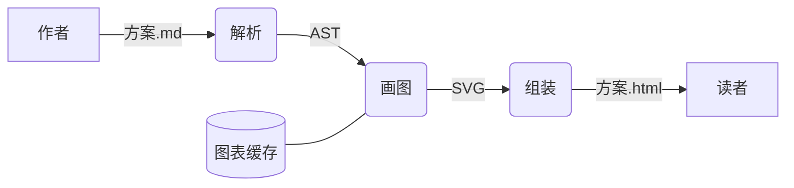

# 数据流图（Mermaid 围栏）

## 这是什么

和[数据流图](/write/diagrams/dataflow)画的是同一种图，区别只在**怎么写**：这一页用 ` ```mermaid ` 围栏，直接写 [Mermaid](/write/diagrams/mermaid/) 自己的图源。

## 什么时候用

- **源文档要发到 GitHub，并且希望在 GitHub 上也能看到图**——自有写法在那边显示成一段普通文字
- 已经会 Mermaid，不想再学一套
- 需要自有写法表达不了的细节（下面「坑」那一节写明是哪些）

其余情况用[自有写法](/write/diagrams/dataflow)：字段名固定，写错了当场报错并指到具体那一行。

## 怎么写

````markdown

````

## 出来是什么样

编译时就画成 SVG 内联进产物，**读者那边不下载任何绘图库、也不联网**。颜色跟着主题走，可以滚轮缩放、按住拖动、双击复位。

## 坑

- **数据流图没有专门的语法，用[流程图](/write/diagrams/flowchart)画**，靠形状区分角色
- 老规矩：**方框**是外部的人或系统、**圆角**是处理步骤、**圆柱**是存起来的东西
- 箭头上的字是**流过去的数据**（`方案.md`、`AST`），不是动作
