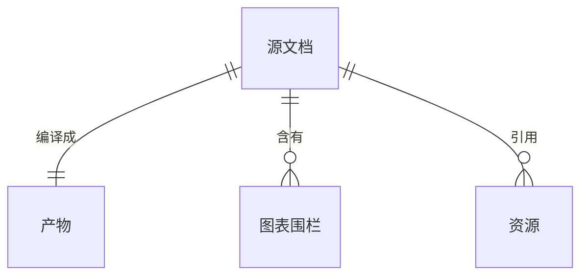

# 实体关系图（Mermaid 围栏）

## 这是什么

和[实体关系图](/write/diagrams/er)画的是同一种图，区别只在**怎么写**：这一页用 ` ```mermaid ` 围栏，直接写 [Mermaid](/write/diagrams/mermaid/) 自己的图源。

## 什么时候用

- **源文档要发到 GitHub，并且希望在 GitHub 上也能看到图**——自有写法在那边显示成一段普通文字
- 已经会 Mermaid，不想再学一套
- 需要自有写法表达不了的细节（下面「坑」那一节写明是哪些）

其余情况用[自有写法](/write/diagrams/er)：字段名固定，写错了当场报错并指到具体那一行。

## 怎么写

````markdown

````

## 出来是什么样

编译时就画成 SVG 内联进产物，**读者那边不下载任何绘图库、也不联网**。颜色跟着主题走，可以滚轮缩放、按住拖动、双击复位。

## 坑

- `||--||` 一对一，`||--o{` 一对多，`}o--o{` 多对多
- 冒号后面是**关系的名字**，用动词（「含有」「引用」），不是名词
- 实体名可以写中文
