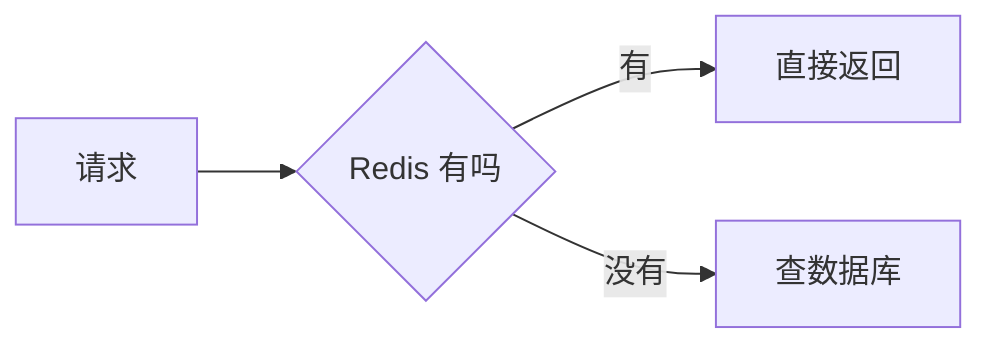

# 流程图（Mermaid 围栏）

## 这是什么

和[流程图](/write/diagrams/flowchart)画的是同一种图，区别只在**怎么写**：这一页用 ` ```mermaid ` 围栏，直接写 [Mermaid](/write/diagrams/mermaid/) 自己的图源。

## 什么时候用

- **源文档要发到 GitHub，并且希望在 GitHub 上也能看到图**——自有写法在那边显示成一段普通文字
- 已经会 Mermaid，不想再学一套
- 需要自有写法表达不了的细节（下面「坑」那一节写明是哪些）

其余情况用[自有写法](/write/diagrams/flowchart)：字段名固定，写错了当场报错并指到具体那一行。

## 怎么写

````markdown

````

## 出来是什么样

编译时就画成 SVG 内联进产物，**读者那边不下载任何绘图库、也不联网**。颜色跟着主题走，可以滚轮缩放、按住拖动、双击复位。

## 坑

- `LR` 是从左到右，`TD` 是从上到下。节点多时用 `TD`，节点少时 `LR` 更扁平
- `[方框]` `(圆角)` `{菱形判断}` `[(圆柱)]` `([胶囊])` 各有含义，别混用
- **梯形 `[/文字/]` 这种花哨形状会让 SVG 体积暴涨**（实测单张 103KB → 换成圆角后 18KB）
