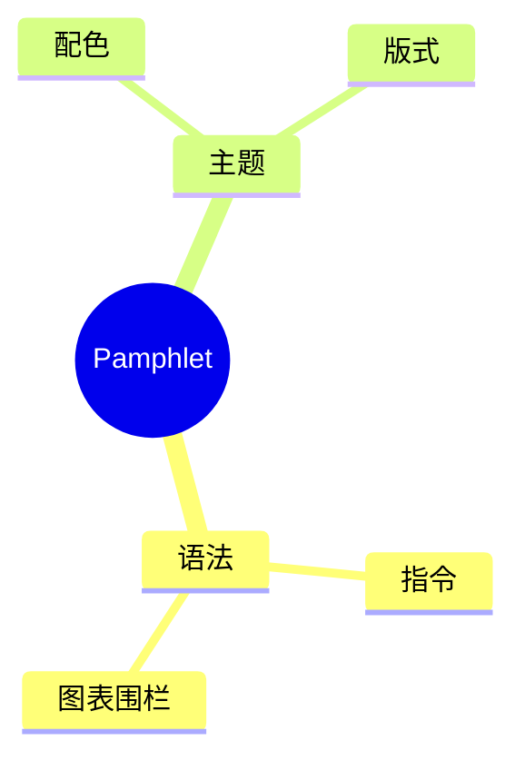

# 思维导图（Mermaid 围栏）

## 这是什么

和[思维导图](/write/diagrams/mindmap)画的是同一种图，区别只在**怎么写**：这一页用 ` ```mermaid ` 围栏，直接写 [Mermaid](/write/diagrams/mermaid/) 自己的图源。

## 什么时候用

- **源文档要发到 GitHub，并且希望在 GitHub 上也能看到图**——自有写法在那边显示成一段普通文字
- 已经会 Mermaid，不想再学一套
- 需要自有写法表达不了的细节（下面「坑」那一节写明是哪些）

其余情况用[自有写法](/write/diagrams/mindmap)：字段名固定，写错了当场报错并指到具体那一行。

## 怎么写

````markdown

````

## 出来是什么样

编译时就画成 SVG 内联进产物，**读者那边不下载任何绘图库、也不联网**。颜色跟着主题走，可以滚轮缩放、按住拖动、双击复位。

## 坑

- **靠缩进表示层级**，不用画箭头
- `root((文字))` 是双括号，画成圆形
- 超过三层就该考虑改用[列表](/write/blocks/lists)——思维导图的优势在「一眼看到全貌」，层数多了就没这个优势了
