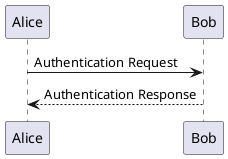

# PlantUML

## 这是什么

PlantUML 是七个里唯一**真正做 UML** 的：组件图、用例图、活动图这些 Mermaid 要么没有、要么只有个形似的简化版。

它也是唯一**需要 Java** 的——这是明知代价的选择，见下面「坑」。

## 它能画哪些图

| 画什么 | 关键字 |
|---|---|
| 时序图 | 直接写 `甲 -> 乙: 消息` |
| 类图 | `class` |
| 用例图 | `usecase` / `actor` |
| 活动图 | `start` / `stop` / `if` |
| 组件图 | `component` / `package` |
| 状态图 | `state` |
| 真 C4 分层 | `!include` C4 标准库 |

**真 C4 视图分层**是它来的理由之一：Mermaid 的 `C4Context` 只有最外一层。

## 怎么写

每张图都用 `@startuml` / `@enduml` 包住：

````markdown

````

`->` 是实线，`-->` 是虚线——和 Mermaid 时序图的约定一致。

> 出处：<https://plantuml.com/sequence-diagram>

## 先装一次

它不跟着 Pamphlet 一起装——用到才装，不用的人一个字节都不多（一个 jar，**还要 Java ≥ 11**）：

```bash
npm i -D @nekoleapuki/pamphlet-engine-plantuml
```

装完跑 `pamphlet doctor` 确认：

```
✓ plantuml（plantuml）
```

**没装就用这种围栏会怎样**：得到 `DIAG-301` 并且**整次编译失败**（不是留个占位框），提示里就是上面那条命令。

许可证：LGPL（选 `plantuml-lgpl` 那个 jar）。

它和另外六个不是一类：不是 npm 包，所以装完引擎包还要**自己下 jar**。选 `plantuml-lgpl` 那个（不内嵌 GraphViz——Pamphlet 本来就单独接 Graphviz），放好之后用环境变量 `PLANTUML_JAR` 指向它。

另外两件要知道的：生成的图归写图源的人所有，不受 GPL 约束；**PlantUML 偶尔会在欢迎图和错误图上显示赞助信息**（正常的图上不会）——那不是 Pamphlet 塞的。

## 坑

- **需要 Java ≥ 11**。这是一项写进文档的可选前置条件，不是隐藏要求：`pamphlet doctor` 会跑 `java -version` 并在缺失时给一条说得清的诊断，而不是让底层 `spawn` 的原始错误冒出来
- Unix 上必须带 `-Djava.awt.headless=true` 调用，否则它去找 X11 图形库（<https://plantuml.com/faq-install>）
- 它是 jar 不是 npm 包，所以装法和另外六个都不一样

> 出处：[ADR-0041](https://github.com/lazygophers/pamphlet/blob/master/docs/adr/0041-engines-are-separate-packages.md)（引擎各自成包）、[ADR-0008](https://github.com/lazygophers/pamphlet/blob/master/docs/adr/0008-builtin-engines.md)（为什么是这七个）
