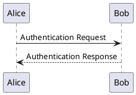

# PlantUML（还没实现）

## 这是什么

PlantUML 是七个里唯一**真正做 UML** 的：组件图、用例图、活动图这些 Mermaid 要么没有、要么只有个形似的简化版。

它也是唯一**需要 Java** 的——这是明知代价的选择，见下面「坑」。

## 它能画哪些图

| 画什么 | 关键字 |
|---|---|
| 时序图 | 直接写 `甲 -> 乙: 消息` |
| 类图 | `class` |
| 用例图 | `usecase` / `actor` |
| 活动图 | `start` / `stop` / `if` |
| 组件图 | `component` / `package` |
| 状态图 | `state` |
| 真 C4 分层 | `!include` C4 标准库 |

**真 C4 视图分层**是它来的理由之一：Mermaid 的 `C4Context` 只有最外一层。

## 怎么写

每张图都用 `@startuml` / `@enduml` 包住：

````markdown

````

`->` 是实线，`-->` 是虚线——和 Mermaid 时序图的约定一致。

> 出处：<https://plantuml.com/sequence-diagram>

## 现在什么状态

**围栏语言 `plantuml` 认得，但引擎还没写。** 写了会得到 `DIAG-301`「没有装能画 plantuml 的引擎」，并且**构建失败**——不是画不出来留个占位框，是整次编译不通过。

将来的依赖形态是**jar，需 Java ≥ 11**，和其余六个一样列为可选依赖：装 `@nekoleapuki/pamphlet-cli` 只得到编译器本体，一个引擎都不带。为什么这么安排见[其余七种引擎](/write/diagrams/others)。

现在要画这种图，先用 [Mermaid 围栏](/write/diagrams/mermaid/)里最接近的一种顶着。

## 坑

- **需要 Java ≥ 11**。这是一项写进文档的可选前置条件，不是隐藏要求：`pamphlet doctor` 会跑 `java -version` 并在缺失时给一条说得清的诊断，而不是让底层 `spawn` 的原始错误冒出来
- Unix 上必须带 `-Djava.awt.headless=true` 调用，否则它去找 X11 图形库（<https://plantuml.com/faq-install>）
- 它是 jar 不是 npm 包，所以装法和另外六个都不一样

> 出处：[ADR-0008](https://github.com/lazygophers/pamphlet/blob/master/docs/adr/0008-builtin-engines.md)
