# Pamphlet 能做什么

你现在看的这个页面**就是一个 `.md` 文件编译出来的**。它是一个文件，没有任何外部请求，把它存下来发给别人，对方双击就能打开。

源文档就藏在这份 HTML 里，跑 `pamphlet extract` 能原样取回来。

这一页**把支持的语法全部用了一遍**，所以它同时是每一套内置主题的样张：同一份源文档换一套主题，看到的差别全部来自主题本身。

## 标题有六级

一级标题是文档标题本身，不进目录。下面这些是二到六级。

### 三级标题

目录默认收到三级（`toc.deep: 3`）。

#### 四级标题

再往下就不进目录了，但字号、间距、颜色仍然由主题决定。

##### 五级标题

###### 六级标题

## 正文里能写的东西

段落里可以有**粗体**、*斜体*、***粗斜体***、~~删除线~~、`行内代码`、[站内链接](#提示块)、[外部链接](https://github.com/lazygophers/pamphlet)，以及裸地址 <https://lazygophers.github.io/pamphlet/>。

> 引用块。主题不同，它可能是一条左线、一段缩进，也可能被排成一条「决策记录」。
>
> 引用块里可以继续写**粗体**和 `代码`。

---

上面那条是分隔线。

### 三种列表

无序列表：

- 第一项
- 第二项
  - 嵌套一层
  - 再来一条
    - 嵌套两层
- 第三项

有序列表：

1. 第一步
2. 第二步
   1. 子步骤
   2. 子步骤
3. 第三步

任务列表（GFM，只读，点不动）：

- [x] 已经做完的
- [ ] 还没做的
- [ ] 另一件还没做的

## 提示块

四种，各自一个指令名。

:::info[这是提示]
写背景、写补充说明。
:::

:::tip[这是建议]
写「这样做更好」。
:::

:::warn[这是警告]
写「不小心会踩到」。
:::

:::danger[这是危险]
写「踩到了会出事」。
:::

不写标题也行：

:::info
没有标题的提示块。
:::

## 可以点的面板

关掉 JavaScript 再看这一段——三个面板会全部展开，标题变成普通小节标题，一个字都不会丢。

::::tabs

:::tab[部署视图]
两个可用区，每区三台。数据库主从跨区。

数据库故障切换靠 DNS，切换窗口约 30 秒。
:::

:::tab[成本视图]{default}
| 项 | 月成本 | 占比 |
| :-- | ---: | :-: |
| 计算 | ¥ 8,400 | 64% |
| 存储 | ¥ 1,200 | 9% |
| 流量 | ¥ 3,600 | 27% |
:::

:::tab[风险视图]
- DNS 切换那 30 秒是全站不可用的
- 跨区流量费按量计，压测时容易超
:::

::::

上面那张表三列分别是左对齐、右对齐、居中——GFM 的对齐语法照常生效。

## 可以折叠的段落

:::collapse[点开看细节]
折叠用的是浏览器原生的 `<details>`，所以没有 JavaScript 时它照样能点开。

运行时只多做一件事：展开时把标题写进网址，方便你把「展开状态」直接发给别人。
:::

:::collapse[这个默认是展开的]{open}
加 `{open}` 就是默认展开，对应原生的 `<details open>`。
:::

## 步骤

:::steps
1. **装一次**

   ```bash
   npm i -g @nekoleapuki/pamphlet-cli
   ```

2. **编译**

   ```bash
   pamphlet build 方案.md
   ```

   得到 `方案.html`，双击打开。

3. **发出去**

   一个文件，不用附带任何东西。
:::

编号是浏览器算的，所以源文档里写 `1.` `1.` `1.` 也会渲染成 1、2、3。

## 滚动入场

:::reveal{effect=fade-up}
这一段滚动到视野里才淡入。它只做视觉节奏，不承载任何信息——关掉 JavaScript 或者打开系统的「减少动态效果」，它就是一段普通文字。
:::

## 图表是提前画好的

下面这些图在**编译的时候**就画成 SVG 了。打开这个页面时不会去下载任何绘图库，也不会在你的浏览器里现场计算布局。

它们的颜色跟着主题走：编译时把引擎输出的固定色值换成 CSS 变量，不是给两套图——整个过程一行 JavaScript 都没有。图可以用滚轮缩放、按住拖动，双击复位。

### 流程图

自有写法：先列节点、再列连线。

```markdown
:::flow[编译的四步]{dir=LR}
nodes:
  src = "方案.md"
  parse = "解析"
  render = "画图"
  out = "方案.html"
edges:
  src -> parse
  parse -> render
  render -> out
:::
```

真的画出来是这样：

:::flow[编译的四步]{dir=LR}
nodes:
  src = "方案.md"
  parse = "解析"
  render = "画图"
  out = "方案.html"
edges:
  src -> parse
  parse -> render
  render -> out
:::

同一张图用 ` ```mermaid ` 围栏写也行，两套写法永久并存：

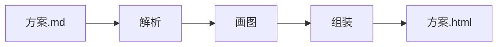

### 时序图

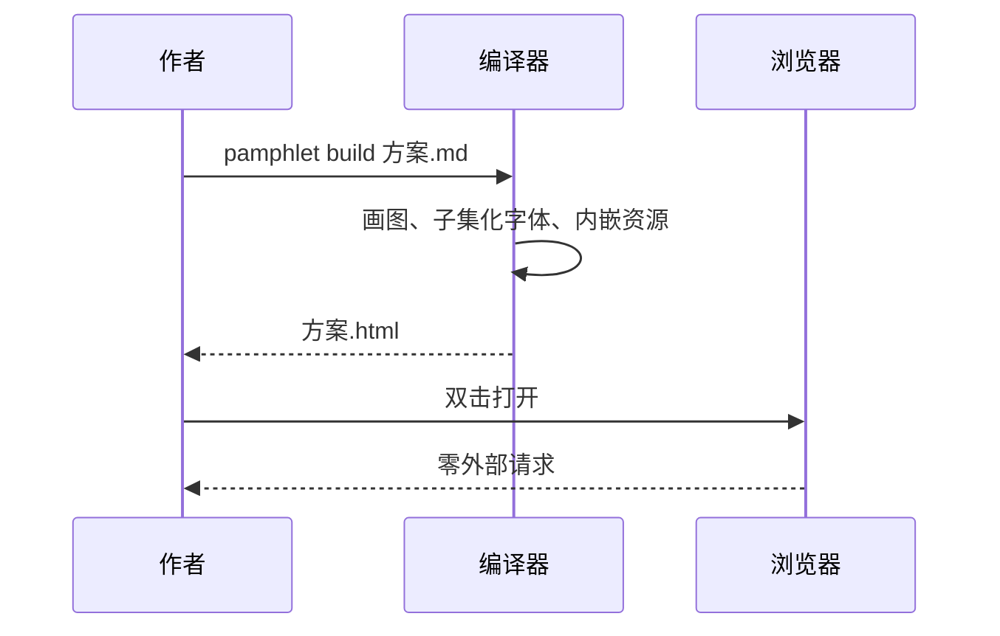

### 状态图

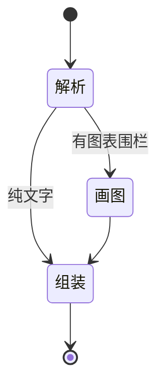

### 类图

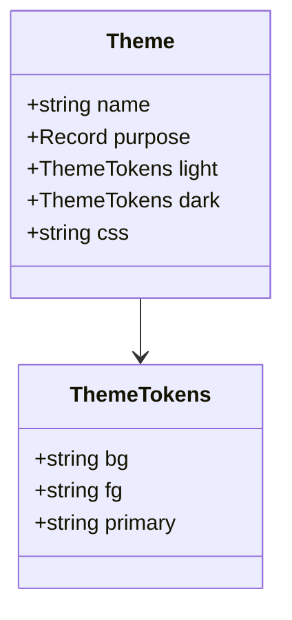

### 实体关系图

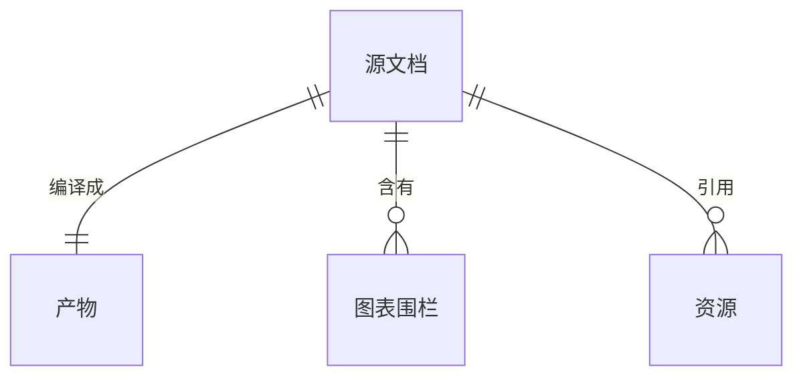

### 甘特图

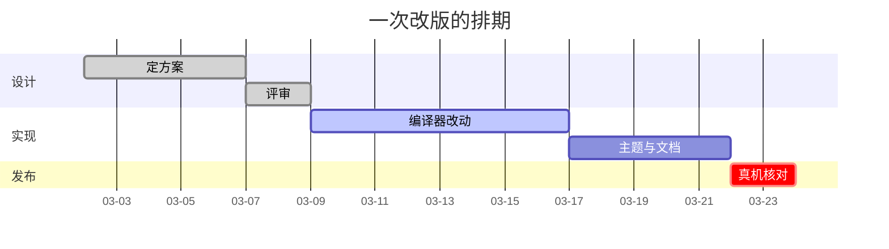

### 饼图

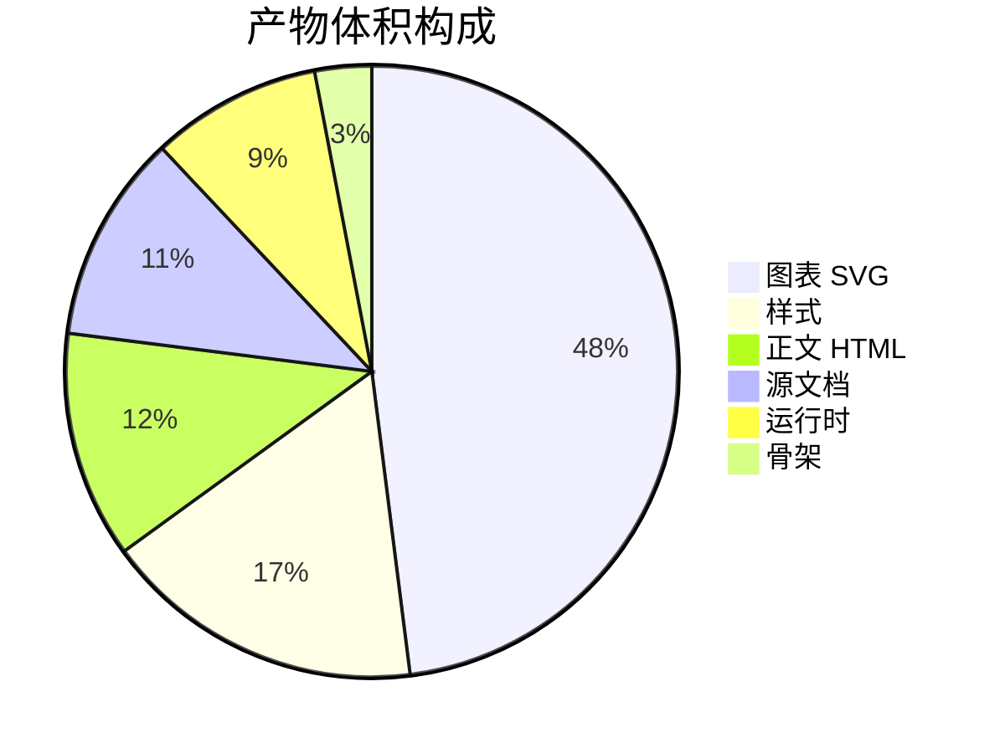

### 架构图


### 系统上下文图（C4）

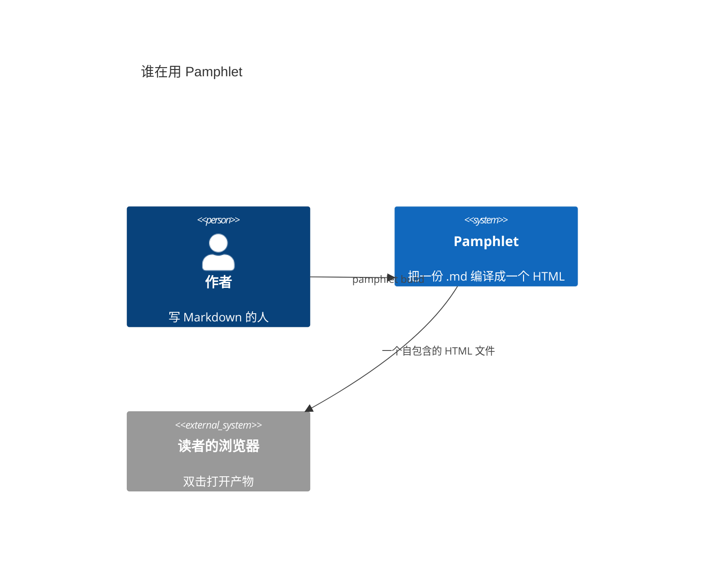

### 数据流图

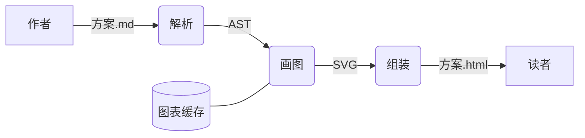

方框是外部的人，圆角是处理步骤，圆柱是存起来的东西——这是数据流图的老规矩。

### 思维导图

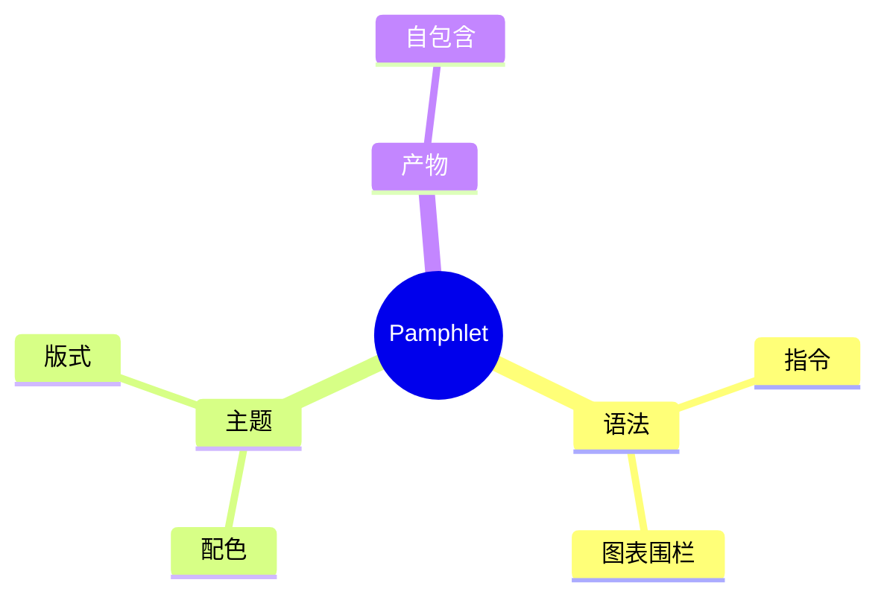

### git 分支图

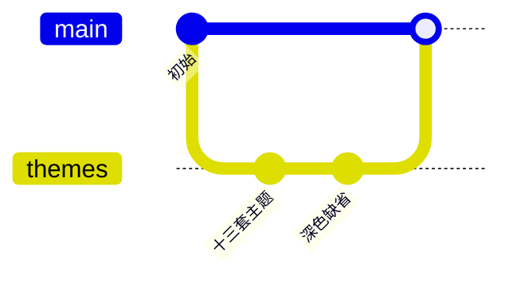

### 块图


### 泳道图

这一种 Mermaid 画不了，SVG 由 Pamphlet 自己算布局、自己生成。

:::swimlane[下单流程]
lanes:
  user = "用户"
  order = "订单服务"
  pay = "支付服务"
steps:
  user : 提交订单
  order : 锁库存
  pay : 扣款
  order : 出单
:::

### 组织架构图

:::orgchart[技术团队]
members:
  技术部
  > 前端组
  >> 张三
  >> 李四
  > 后端组
  >> 王五
:::

### 数据图表

:::chart[月度请求量]{type=bar}
points:
  一月 : 120
  二月 : 180
  三月 : 150
:::

## 图片是内嵌的

图片在编译时编码成 base64 写进产物，所以断网、拷到 U 盘里都一样能看。


路径相对于源文档所在目录。远程图片直接报错——否则产物就不再是自包含的了。

## 代码与表格

代码块按语言高亮：

```typescript
export function assembleRuntime(features: Iterable<string>): string {
  const used = RUNTIME_FEATURES.filter((f) => [...features].includes(f))
  if (used.length === 0) return ''   // 一个特性都没用到就一个字节都不放
  return [KERNEL, ...used.map((f) => FRAGMENTS[f]), BOOT].join('\n')
}
```

```bash
pamphlet build "docs/**/*.md" --theme incident --fail-on-warn
```

```yaml
---
title: 架构方案
theme: architecture
toc:
  enable: true
---
```

不标语言的代码块是纯文本：

```
error[DIR-204] tab 缺少指令标题
  --> 方案.md:3:1
```

表格：

| 承诺 | 怎么验的 |
| --- | --- |
| 打开时零外部请求 | 真 Chromium 打开产物，拦网络层数请求数 |
| 内容安全策略认哈希 | 注入一段脚本，浏览器必须拒绝执行它 |
| 没有 JavaScript 也能读 | 关掉 JavaScript 打开，面板内容仍然全可见 |
| 深色是缺省 | 读 `getComputedStyle`，逐套主题验 |

## 这个文件有多大

编译时加 `--verbose` 会把体积拆开给你看：哪一项占了多少、gzip 之后是多少。不设上限，只摊开给你自己判断。
