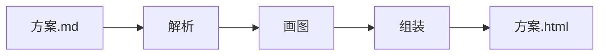

# Pamphlet 能做什么

你现在看的这个页面**就是一个 `.md` 文件编译出来的**。它是一个文件，没有任何外部请求，把它存下来发给别人，对方双击就能打开。

源文档就藏在这份 HTML 里，跑 `pamphlet extract` 能原样取回来。

## 提示块

四种，各自一个指令名。

:::info[这是提示]
写背景、写补充说明。
:::

:::tip[这是建议]
写「这样做更好」。
:::

:::warn[这是警告]
写「不小心会踩到」。
:::

:::danger[这是危险]
写「踩到了会出事」。
:::

## 可以点的面板

关掉 JavaScript 再看这一段——三个面板会全部展开，标题变成普通小节标题，一个字都不会丢。

::::tabs

:::tab[部署视图]
两个可用区，每区三台。数据库主从跨区。

数据库故障切换靠 DNS，切换窗口约 30 秒。
:::

:::tab[成本视图]{default}
| 项 | 月成本 |
| --- | --- |
| 计算 | ¥ 8,400 |
| 存储 | ¥ 1,200 |
| 流量 | ¥ 3,600 |
:::

:::tab[风险视图]
- DNS 切换那 30 秒是全站不可用的
- 跨区流量费按量计，压测时容易超
:::

::::

## 可以折叠的段落

:::collapse[点开看细节]
折叠用的是浏览器原生的 `<details>`，所以没有 JavaScript 时它照样能点开。

运行时只多做一件事：展开时把标题写进网址，方便你把「展开状态」直接发给别人。
:::

## 图表是提前画好的

下面这张图在**编译的时候**就画成 SVG 了。打开这个页面时不会去下载任何绘图库，也不会在你的浏览器里现场计算布局。



它的颜色跟着页面走：把系统调成深色再看这一页，图里的线条和文字会一起变深浅。做法是编译时把引擎输出的固定色值换成 CSS 变量，不是给两套图——整个过程一行 JavaScript 都没有。

图可以用滚轮缩放、按住拖动，双击复位。

## 代码与表格

```typescript
export function assembleRuntime(features: Iterable<string>): string {
  const used = RUNTIME_FEATURES.filter((f) => [...features].includes(f))
  if (used.length === 0) return ''   // 一个特性都没用到就一个字节都不放
  return [KERNEL, ...used.map((f) => FRAGMENTS[f]), BOOT].join('\n')
}
```

| 承诺 | 怎么验的 |
| --- | --- |
| 打开时零外部请求 | 真 Chromium 打开产物，拦网络层数请求数 |
| 内容安全策略认哈希 | 注入一段脚本，浏览器必须拒绝执行它 |
| 没有 JavaScript 也能读 | 关掉 JavaScript 打开，面板内容仍然全可见 |

## 这个文件有多大

编译时加 `--verbose` 会把体积拆开给你看：哪一项占了多少、gzip 之后是多少。不设上限，只摊开给你自己判断。
