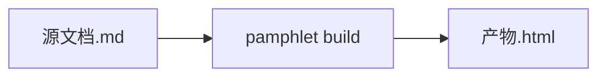

# @pamphlet/cli

把一份 Markdown 编译成**一个能双击打开的 HTML 文件**。不联网、不带依赖、图是提前画好的静态 SVG、面板可以点、关掉 JavaScript 照样从头读到尾。

```bash
npx @pamphlet/cli build 方案.md      # 得到 方案.html，发给谁都能直接打开
```

不想每次都打这么长，就装到全局，命令名是 `pamphlet`：

```bash
npm i -g @pamphlet/cli
pamphlet build 方案.md
```

## 四条承诺

| 承诺 | 具体是什么 |
|---|---|
| **自包含** | 打开时不向网络要任何东西。引用远程图片会直接编译失败（`EMB-403`），没有绕过开关 |
| **图表预渲染** | 图在你的机器上画完，读者那边不跑任何图表库 |
| **交互可点** | Tab 可切换、折叠块可展开、图表可缩放拖动 |
| **无 JavaScript 可降级** | 关掉 JavaScript，Tab 变成全部展开、折叠块变成原生 `<details>`，内容一个字不丢 |

## 六个命令

```
pamphlet build   <路径...> [选项]   编译成单文件 HTML
pamphlet serve   <路径>    [选项]   本地预览，源文档改了就重新加载
pamphlet lint    <路径...> [选项]   检查语法并报诊断
pamphlet ast     <路径>    [选项]   输出 AST JSON
pamphlet extract <产物.html>        从产物反解出源文档
pamphlet doctor                     各图表引擎装了没有
```

退出码：`0` 成功 / `1` 编译错误 / `2` 参数或用法错误 / `3` 环境缺失。

## 语法

CommonMark 严格超集，加九个容器指令和八种图表围栏。源文档沿用 `.md`，直接丢上 GitHub 仍然能读。

````markdown
::::tabs

:::tab[部署视图]{default}
两个可用区，互为主备。
:::

:::tab[成本视图]
月成本约 ¥3,200。
:::

::::


````

规则只有一条：`[label]` 是给读者看的标题，`{attrs}` 是给编译器看的参数。嵌套时**外层的冒号要比内层多**。

## 要画图的话

本版本只实现了 Mermaid 一个引擎，它走无头浏览器：

```bash
npm i -g mermaid-isomorphic playwright && npx playwright install chromium
```

首次约 150MB、约 1 分钟，装一次就好。纯文字文档永远不会拉起浏览器。

跑 `pamphlet doctor` 看各引擎的安装状态。

## 要求

Node.js ≥ 20。

## 兼容性

**0.x 期间只承诺修订号兼容**：`0.0.1 → 0.0.2` 不破坏任何东西，`0.0 → 0.1` 允许破坏语法、CLI 参数和 AST。

## 文档

**<https://lazygophers.github.io/pamphlet/>**（[English](https://lazygophers.github.io/pamphlet/en/)）

- [语法手册](https://lazygophers.github.io/pamphlet/guide/syntax.html)
- [命令行](https://lazygophers.github.io/pamphlet/guide/cli.html)
- [已知边界](https://lazygophers.github.io/pamphlet/limits/mobile.html) —— 五条看起来像 bug、其实是设计的行为
- [诊断码表](https://lazygophers.github.io/pamphlet/reference/diagnostics.html)

看一眼产物：<https://lazygophers.github.io/pamphlet/demo/>

## 许可证

AGPL-3.0-or-later
