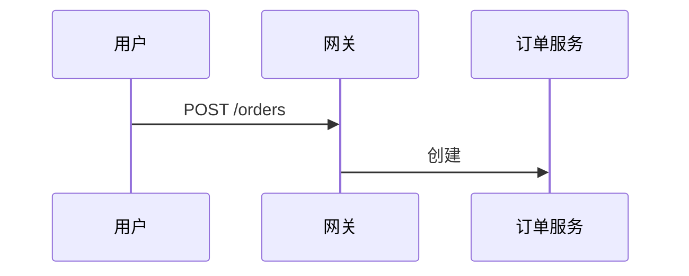

# 订单系统方案

一段正文，含 **强调**、`行内代码` 和 [链接](https://example.com)。

## 方案对比

::::tabs
:::tab[部署视图]
甲方案：网关直连订单服务。

:::
:::tab[成本视图]
| 项 | 甲 | 乙 |
| --- | --- | --- |
| 机器 | 2 | 4 |
:::
::::

## 备注

H2O 是水。按 <kbd>Ctrl</kbd>+<kbd>C</kbd> 复制。

- [x] 已确认
- [ ] 待确认
