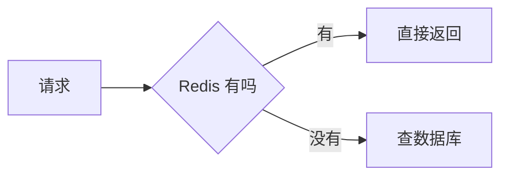

# 写好一份 Pamphlet 文档

语法怎么写见 `pamphlet-syntax`，挑主题见 `pamphlet-theme`。这一份讲**判断**：同样合法的几种写法里该选哪个。

## 先想清楚这份文档是什么

产物是**一个能双击打开、断网也能看的 HTML 文件**。它的使用场景通常是：发给一个不装任何工具的人、附在邮件里、塞进 U 盘、归档。

所以两条贯穿始终：

- **读者不会去点别的链接。** 站外链接对他可能是打不开的。需要的内容就写进来
- **一份源文档 = 一个产物。** 没有配置文件，配置全在 frontmatter 里，拷贝文档就等于拷贝配置

## 结构：让目录能读

```yaml
---
title: 支付链路改造方案
theme: architecture
toc:
  enable: true
  deep: 2
---
```

- **目录默认是关的**，`enable: true` 才有。长过三屏的文档就该打开
- `deep` 缺省 `2`，收到二级标题。超过 3 的目录通常没人看
- **二级标题是骨架**。一份文档的 `##` 列出来，应该就是它的提纲——写完扫一眼目录，读不懂就是结构有问题，不是目录的问题
- 一级标题（`#`）只写一个，它是文档标题本身，不进目录

## 四种提示块怎么选

| 用哪个 | 什么时候 |
|---|---|
| `info` | 补充说明，不看也不影响 |
| `tip` | 有更省事的做法 |
| `warn` | 不注意会出问题 |
| `danger` | 一定出问题，或者不可逆 |

**别滥用。** 四种的区别只在左边那条竖线的颜色，不渲染任何图标——一页上五个提示块，读者一个都不会当回事。一屏里最多一个 `danger`。

正文能说清楚的话就写正文。提示块是「跳出正文流」的手段，跳多了就没有正文流了。

## 什么时候用标签页、折叠块

- **标签页（`tabs`）= 同一件事的几种视角**：部署视图 / 成本视图、macOS / Linux、方案甲 / 方案乙。**不是**「几个不相关的章节」——那是标题该干的活
- **折叠块（`collapse`）= 大多数人不用看的细节**：完整配置、原始日志、附录。默认收起，`{open}` 只留给「多数人要看但占地方」的那种
- **标签页里放的内容长度要差不多**。一个 Tab 三行、另一个三屏，读者会以为短的那个没写完

关掉 JavaScript 时标签页**三个面板全部展开**、折叠块降级成原生 `<details>`。这意味着：**别用它们藏关键信息**，也别指望它们真的能「隐藏」什么——内容一直在 DOM 里。

## 步骤和滚动入场

- **`steps` 里必须是有序列表**，每一步是一个有边界的动作。一步里出现两个「然后再」就该拆
- 每一步可以很长：段落、代码块、图片缩进对齐就行
- **`reveal` 只做视觉节奏，不承载信息**。任何在「没有动效」时会丢失的东西都不该放它里面——开了系统的「减少动态效果」它就直接不动了

## 图表：画到能看清为止



- **一张图一件事。** 单张 SVG 超过 200KB 会报 `DIAG-302`，那通常意味着节点太多——读者也看不清，拆成几张
- **图是内容不是装饰。** 去掉它信息有损才该画
- 图的颜色自动跟着主题走，深色模式下线和字一起变。**别在图源里写死颜色**——写死的会报 `DIAG-304`，并且在暗色下可能看不清
- 图画不出来时**产物照样写出来**，那张图的位置留个占位框、退出码 `1`。所以 CI 里要看退出码，不能只看有没有产物

## 体积：把账摊开再决定

```bash
pamphlet build 方案.md --verbose
```

```
demo.html  33.7KB
  体积 33.7KB（gzip 10.6KB）
    图表 SVG          16.0KB  gzip     2.8KB  48%
    样式               5.7KB  gzip     1.4KB  17%
    正文 HTML          4.0KB  gzip     2.1KB  12%
```

各段互不重叠、加起来正好是整份产物。**Pamphlet 不设体积门槛**，要不要为了 16KB 去掉一张图是你的判断。

省体积的两条实招：截图改成图表围栏（SVG 通常比 PNG 小一个量级）；真要放图先压（`pngquant --quality=70`）。单个资源硬上限 2MB。

## 交付前跑这三条

```bash
pamphlet doctor                 # 图表引擎装了没有。缺引擎退出码 3，不是 1
pamphlet lint "docs/**/*.md"    # 只检查、不产出文件
pamphlet build 方案.md --fail-on-warn
```

- `doctor` 的退出码 `3` 是「机器上没装东西」，`1` 是「文档写错了」——分开是为了让 CI 能区分这两件事
- **`--fail-on-warn` 该开**。警告里最常见的是「未知 frontmatter 字段」和「未知指令」，两者都意味着你写的某句话没生效，而产物看起来是正常的
- 通配符**要加引号**，而且**不做任何默认排除**——`"**/*.md"` 会把 `node_modules` 一起编了

## 最后：真的打开看一眼

浏览器双击产物，做三件事：拖到最底、点一下每个标签页和折叠块、把窗口拉窄到手机宽度。

自动化测试盯的是「不崩」，长相只有眼睛能验。
