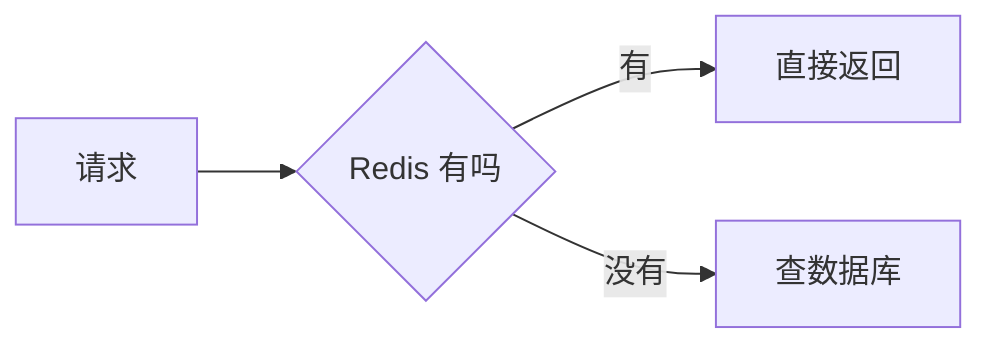

# Pamphlet 语法

Pamphlet 把**一份 Markdown 编译成一个能双击打开的 HTML 文件**。产物里没有 `<link>`、没有 `<script src>`、没有 CDN 引用：图表编译时就画成静态 SVG 内联进去，字体子集化成 data URI，图片 base64。断网、`file://`、U 盘拷来拷去，行为完全一样。

```bash
npx @nekoleapuki/pamphlet-cli build 方案.md
```

产物写在源文档旁边：`方案.md` → `方案.html`。

## 指令只有一条规则

```
:::name[标题]{属性}
```

- `[标题]` 永远是**给读者看的字**
- `{属性}` 永远是**给编译器看的参数**

全部九个指令都是**容器**，必须成对的冒号包住内容。写成 `::name[内容]` 这种单行形态报 `DIR-202`。

**嵌套时外层冒号必须比内层多。** `:::tabs` 包 `:::tab` 不成立——冒号一样多，第一个 `:::` 就把外层关掉了。

## 九个指令

| 指令 | 标题 | 属性 | 必须包含 |
|---|---|---|---|
| `info` `tip` `warn` `danger` | 可选 | 不接受 | — |
| `tabs` | — | 不接受 | 至少一个 `tab` |
| `tab` | **必填** | `default` | — |
| `collapse` | **必填** | `open` | — |
| `steps` | — | 不接受 | 一个有序列表 |
| `reveal` | — | `effect` | — |

属性取值：`default` 和 `open` 都不带值；`effect` 取 `fade-up`（缺省）/ `fade-in` / `slide-left` / `slide-right`，写别的报 `DIR-206`。

`class` 和 `id` 写了不报错，但**产物里不输出**——值被静默丢弃。改样式走 token（见 `pamphlet-theme`）。

```markdown
:::warn[小心]
四种提示块的区别只在左边那条竖线的颜色，不渲染任何图标。
:::

::::tabs

:::tab[部署视图]{default}
外层四个冒号，内层三个。
:::

:::tab[成本视图]
同一组里 `{default}` 最多一个，标两个报 `DIR-205`；都不标选中第一个。
:::

::::

:::collapse[高级参数]{open}
标题必填——无 JavaScript 时它降级成原生 `<details>`，标题就是 `<summary>`。
:::

:::steps
1. 里面必须是**有序列表**，写成 `-` 报 `DIR-204`
2. 编号由浏览器算，源文档里写 `1.` `1.` `1.` 也会渲染成 1、2、3
:::

:::reveal{effect=slide-left}
只做视觉节奏，不承载信息。关掉 JavaScript 时内容直接可见。
:::
```

**没有 `callout` 这个指令**——它是那四种块的统称。写 `:::callout` 报 `DIR-201`。

打错名字不致命：`note` → `info`、`warning` / `caution` → `warn`、`important` → `danger`、`details` / `accordion` → `collapse`、`tabset` → `tabs`，诊断会直接告诉你真名。不认识的指令只是 `DIR-201` **警告**，内容照样原样输出。

## frontmatter：全部配置都在这里

**没有配置文件。** 认识的字段只有六个，写别的报 `DOC-102` 警告并列出清单——不静默忽略，否则你会以为配置生效了。

```yaml
---
spec: 1
title: 架构方案
theme: incident
lang: zh-CN
toc:
  enable: true
  deep: 3
---
```

| 字段 | 类型 | 缺省 |
|---|---|---|
| `spec` | 整数 | 不填 = 不检查。当前编译器支持 `1` |
| `title` | 字符串 | 第一个 `#` 标题，都没有就用 `pamphlet` |
| `theme` | 字符串 | `default`，全部内置主题见 `pamphlet-theme` |
| `lang` | 字符串 | `zh-CN` |
| `toc` | 布尔或对象 | 关 |
| `engines` | 对象 | ⚠️ 尚未实现，写了报 `DOC-104` 警告 |

`toc` 的子字段：`enable`（布尔，缺省 `false`，**不显式打开就没有目录**）/ `deep`（1–6，缺省 `2`）/ `skipTabs`（布尔，缺省 `true`）/ `position`（`top` / `side`，**缺省 `side`**）。

`side` 是一个常驻侧边菜单，纯 CSS sticky，零 JavaScript，窄屏（< 60rem）自动退回顶部。一级标题（`#`）不进目录——它是文档标题本身。

## 图表：写成带语言标记的代码块

````markdown

````

- **本版本只实现了 `mermaid`。** `d2` / `dot` / `math` / `vega-lite` / `wavedrom` / `bytefield` / `plantuml` 写了报 `DIAG-301`，构建失败
- 语言名就是引擎自己的名字，没有自有别名——在 Pamphlet 里练会的 Mermaid 语法，在 GitHub、Notion 里同样有效
- **一个 `mermaid` 围栏画十几种图**，第一行的关键字决定画哪种：`flowchart` / `sequenceDiagram` / `stateDiagram-v2` / `classDiagram` / `erDiagram` / `gantt` / `pie` / `architecture-beta`（架构图）/ `C4Context`（系统上下文）/ `mindmap` / `gitGraph` / `block-beta`。**数据流图用 `flowchart`**：方框是外部的人、圆角是处理、`[(…)]` 是存起来的东西
- **两种图不认中文**：`sankey-beta` 和 `requirementDiagram` 的解析器只认 ASCII 标识符，中文节点名直接报 `DIAG-303`。`architecture-beta` 的 ID 也必须是 ASCII，但方括号里的标签可以是中文
- 图的颜色会被换成主题变量，所以深色模式下线和字一起变。换不掉的硬编码色值报 `DIAG-304` 警告
- 单张图 SVG 超过 200KB 报 `DIAG-302` 警告——通常意味着节点太多，读者也看不清
- **图画不出来时产物照样写出来**：那张图的位置留一个占位框写明原因，退出码 `1`
- Mermaid 要先装一次：`npm i -g mermaid-isomorphic playwright && npx playwright install chromium`（约 150MB）。纯文字文档不会拉起浏览器

## 图片和字体：全部内嵌

```markdown

```

- **路径相对于源文档所在目录**，不是相对于你跑命令的目录。读不到报 `EMB-402`
- **远程图片直接报 `EMB-403`，没有绕过开关**——否则会产出一个需要联网的 HTML，那就破坏了自包含这条承诺。先下载到本地再引用
- 单个资源上限 **2MB**，超了报 `EMB-401`。base64 会让体积膨胀 33.3%
- 内嵌字体：`--font ./思源黑体.otf`，只留文档用到的字。`.ttc` 不能子集化，报 `EMB-404`

## Markdown 本身

CommonMark 全部支持；GFM 的表格、删除线、任务列表、自动链接都支持；**裸 HTML 原样通过，不过滤**（所以可以写一段 `<style>` 覆盖主题变量）。

两个不支持的：**脚注 `[^1]` 报 `DOC-105`**（引用和定义各报一条），**行内公式 `$x$` 不支持**，只有块级 ` ```math ` 围栏（而它本身还没实现）。

## build 的选项

| 选项 | 说明 |
|---|---|
| `-o <路径>` | 产物写到哪。只在编译单份时可用 |
| `--theme <名字>` | 换主题，**压过 frontmatter** |
| `--font <字体文件>` | 内嵌字体 |
| `--verbose` | 打印体积归因，各段加起来正好是整份产物 |
| `--fail-on-warn` | 警告也算失败 |
| `--continue-on-error` | 某份出错后继续编译剩下的 |

**通配符要加引号**：`pamphlet build "docs/**/*.md"`。通配符由 Pamphlet 自己展开，不依赖 shell，而且**不做任何默认排除**——`"**/*.md"` 会把 `node_modules` 里成百上千份第三方文档一起编译。

## 报错了

全部 21 个诊断码和它们的意思见 [diagnostics.md](diagnostics.md)。每条诊断都带位置、原因、修复建议，最后一行的链接指向文档站上对应的锚点。
